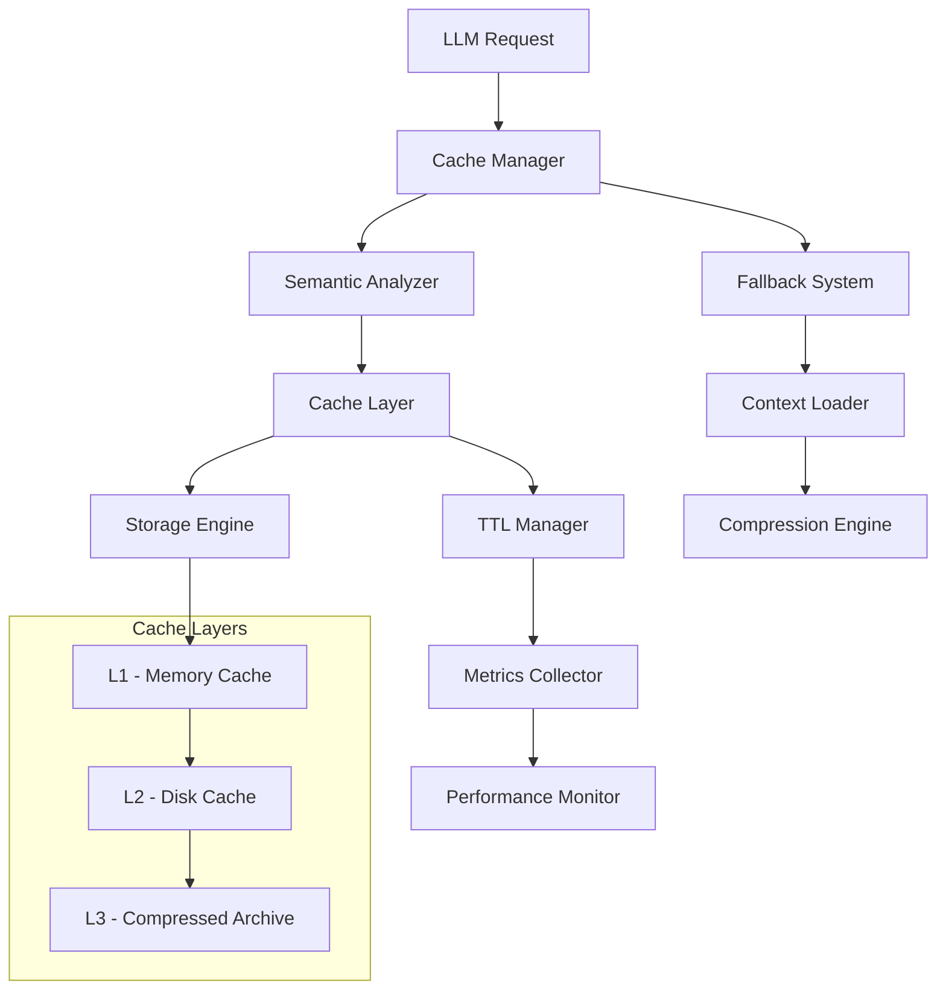

# Arquitetura de Cache Semântico - Agent Nuxt

**Data:** 21/09/2025 23:15:00 (America/Sao_Paulo)  
**Objetivo:** Projetar sistema de cache inteligente para otimização de contextos LLM no Agent Nuxt.

## Visão Geral da Arquitetura

O Sistema de Cache Semântico do Agent Nuxt é projetado para otimizar o carregamento e processamento de contextos para LLMs, utilizando algoritmos inteligentes de cache baseados em frequência, recência e relevância semântica.

### Princípios Fundamentais

1. **Cache Semântico**: Baseado no conteúdo e contexto, não apenas em chaves simples
2. **Adaptive TTL**: Time-to-Live adaptativo baseado em padrões de uso
3. **Compression Aware**: Compressão específica para conteúdo markdown
4. **Fallback Intelligent**: Sistema de fallback otimizado para cache miss
5. **Performance Metrics**: Monitoramento contínuo de eficiência

## Arquitetura de Componentes



## Componentes Principais

### 1. Cache Manager
**Responsabilidade**: Orquestração geral do sistema de cache

```typescript
interface CacheManager {
  get(key: string, context?: CacheContext): Promise<CacheResult>
  set(key: string, value: any, options?: CacheOptions): Promise<void>
  invalidate(pattern: string): Promise<void>
  getStats(): CacheStats
}

interface CacheContext {
  requestType: 'component' | 'standard' | 'spec' | 'product'
  priority: 'low' | 'medium' | 'high' | 'critical'
  semanticTags: string[]
  userProfile?: UserProfile
}
```

### 2. Semantic Analyzer
**Responsabilidade**: Análise semântica de contextos para otimização de cache

```typescript
interface SemanticAnalyzer {
  analyzeContent(content: string): SemanticSignature
  calculateRelevance(signature: SemanticSignature, context: CacheContext): number
  generateCacheKey(signature: SemanticSignature): string
  findRelatedContent(signature: SemanticSignature): string[]
}

interface SemanticSignature {
  contentType: string
  keywords: string[]
  complexity: number
  dependencies: string[]
  updateFrequency: 'static' | 'low' | 'medium' | 'high'
}
```

### 3. Storage Engine
**Responsabilidade**: Gerenciamento de múltiplas camadas de armazenamento

```typescript
interface StorageEngine {
  l1: MemoryCache     // Hot cache - contextos mais frequentes
  l2: DiskCache       // Warm cache - contextos moderadamente usados
  l3: ArchiveCache    // Cold cache - contextos raramente usados
}

interface CacheLayer {
  get(key: string): Promise<CacheEntry | null>
  set(key: string, entry: CacheEntry): Promise<void>
  delete(key: string): Promise<void>
  clear(): Promise<void>
  getSize(): number
}
```

## Estratégias de Cache

### 1. Cache por Frequência (Frequency-Based)

```typescript
class FrequencyBasedCache {
  private accessCount: Map<string, number> = new Map()
  private lastAccess: Map<string, Date> = new Map()
  
  calculateScore(key: string): number {
    const count = this.accessCount.get(key) || 0
    const lastAccessTime = this.lastAccess.get(key)
    const recency = lastAccessTime ? 
      (Date.now() - lastAccessTime.getTime()) / (1000 * 60 * 60) : Infinity
    
    // Score = frequency * recency_factor
    return count * Math.exp(-recency / 24) // Decay over 24 hours
  }
  
  shouldCache(key: string, content: string): boolean {
    const score = this.calculateScore(key)
    const contentSize = content.length
    
    // Cache if high frequency or small size with medium frequency
    return score > 5 || (score > 2 && contentSize < 10000)
  }
}
```

### 2. Cache por Recência (Recency-Based)

```typescript
class RecencyBasedCache {
  private accessTimes: Map<string, Date[]> = new Map()
  
  trackAccess(key: string): void {
    const times = this.accessTimes.get(key) || []
    times.push(new Date())
    
    // Keep only last 10 accesses
    if (times.length > 10) {
      times.shift()
    }
    
    this.accessTimes.set(key, times)
  }
  
  calculateRecencyScore(key: string): number {
    const times = this.accessTimes.get(key) || []
    if (times.length === 0) return 0
    
    const now = Date.now()
    const weights = [1, 0.8, 0.6, 0.4, 0.2] // Recent accesses have higher weight
    
    return times
      .slice(-5) // Last 5 accesses
      .reverse()
      .reduce((score, time, index) => {
        const hoursSince = (now - time.getTime()) / (1000 * 60 * 60)
        const weight = weights[index] || 0.1
        return score + (weight / Math.max(hoursSince, 0.1))
      }, 0)
  }
}
```

### 3. Cache por Relevância Semântica

```typescript
class SemanticRelevanceCache {
  private embeddings: Map<string, number[]> = new Map()
  
  async calculateSemanticSimilarity(content1: string, content2: string): Promise<number> {
    const embedding1 = await this.generateEmbedding(content1)
    const embedding2 = await this.generateEmbedding(content2)
    
    return this.cosineSimilarity(embedding1, embedding2)
  }
  
  private async generateEmbedding(content: string): Promise<number[]> {
    // Simplified semantic analysis - in production, use proper embeddings
    const words = content.toLowerCase().split(/\s+/)
    const keywords = ['nuxt', 'vue', 'typescript', 'component', 'cache', 'performance']
    
    return keywords.map(keyword => 
      words.filter(word => word.includes(keyword)).length / words.length
    )
  }
  
  private cosineSimilarity(a: number[], b: number[]): number {
    const dotProduct = a.reduce((sum, val, i) => sum + val * b[i], 0)
    const magnitudeA = Math.sqrt(a.reduce((sum, val) => sum + val * val, 0))
    const magnitudeB = Math.sqrt(b.reduce((sum, val) => sum + val * val, 0))
    
    return dotProduct / (magnitudeA * magnitudeB)
  }
}
```

## Algoritmos de Compressão

### 1. Markdown-Specific Compression

```typescript
class MarkdownCompressor {
  compress(content: string): CompressedContent {
    const timestamp = new Date().toLocaleString('pt-BR', {
      timeZone: 'America/Sao_Paulo',
      year: 'numeric',
      month: '2-digit',
      day: '2-digit',
      hour: '2-digit',
      minute: '2-digit',
      second: '2-digit'
    })
    
    // Step 1: Extract and compress repeated patterns
    const patterns = this.extractPatterns(content)
    const patternMap = this.createPatternMap(patterns)
    let compressed = this.replacePatterns(content, patternMap)
    
    // Step 2: Compress whitespace and formatting
    compressed = this.compressWhitespace(compressed)
    
    // Step 3: Dictionary compression for common terms
    const dictionary = this.buildDictionary(compressed)
    compressed = this.applyDictionary(compressed, dictionary)
    
    // Step 4: Standard compression (gzip-like)
    const finalCompressed = this.standardCompress(compressed)
    
    return {
      data: finalCompressed,
      dictionary,
      patternMap,
      originalSize: content.length,
      compressedSize: finalCompressed.length,
      compressionRatio: finalCompressed.length / content.length,
      timestamp
    }
  }
  
  private extractPatterns(content: string): Map<string, number> {
    const patterns = new Map<string, number>()
    
    // Common markdown patterns
    const commonPatterns = [
      /```[\s\S]*?```/g,        // Code blocks
      /\[.*?\]\(.*?\)/g,        // Links
      /#{1,6}\s+.*$/gm,         // Headers
      /\*\*.*?\*\*/g,           // Bold
      /\*.*?\*/g,               // Italic
      /- \[[ x]\] /g,           // Checkboxes
    ]
    
    commonPatterns.forEach(pattern => {
      const matches = content.match(pattern) || []
      matches.forEach(match => {
        patterns.set(match, (patterns.get(match) || 0) + 1)
      })
    })
    
    return patterns
  }
  
  decompress(compressed: CompressedContent): string {
    let content = this.standardDecompress(compressed.data)
    content = this.reverseApplyDictionary(content, compressed.dictionary)
    content = this.reverseReplacePatterns(content, compressed.patternMap)
    content = this.decompressWhitespace(content)
    
    return content
  }
}
```

### 2. Context-Aware Compression

```typescript
class ContextAwareCompressor {
  compressByType(content: string, type: 'standard' | 'product' | 'spec'): CompressedContent {
    const timestamp = new Date().toLocaleString('pt-BR', {
      timeZone: 'America/Sao_Paulo',
      year: 'numeric',
      month: '2-digit',
      day: '2-digit',
      hour: '2-digit',
      minute: '2-digit',
      second: '2-digit'
    })
    
    switch (type) {
      case 'standard':
        return this.compressStandardContext(content, timestamp)
      case 'product':
        return this.compressProductContext(content, timestamp)
      case 'spec':
        return this.compressSpecContext(content, timestamp)
      default:
        return this.genericCompress(content, timestamp)
    }
  }
  
  private compressStandardContext(content: string, timestamp: string): CompressedContent {
    // Standards have lots of repetitive patterns and code examples
    const codeBlocks = this.extractCodeBlocks(content)
    const compressedCode = this.compressCodeBlocks(codeBlocks)
    
    let processed = this.replaceCodeBlocks(content, compressedCode)
    processed = this.compressRepeatedSections(processed)
    
    return {
      data: this.standardCompress(processed),
      metadata: { type: 'standard', codeBlocks: compressedCode },
      originalSize: content.length,
      compressedSize: processed.length,
      compressionRatio: processed.length / content.length,
      timestamp
    }
  }
}
```

## Sistema de TTL Configurável

### 1. Adaptive TTL Manager

```typescript
class AdaptiveTTLManager {
  private ttlConfigs: Map<string, TTLConfig> = new Map()
  private accessPatterns: Map<string, AccessPattern> = new Map()
  
  calculateTTL(key: string, contentType: string, metadata: CacheMetadata): number {
    const timestamp = new Date().toLocaleString('pt-BR', {
      timeZone: 'America/Sao_Paulo',
      year: 'numeric',
      month: '2-digit',
      day: '2-digit',
      hour: '2-digit',
      minute: '2-digit',
      second: '2-digit'
    })
    
    const baseConfig = this.ttlConfigs.get(contentType) || this.getDefaultTTL()
    const accessPattern = this.accessPatterns.get(key)
    
    let ttl = baseConfig.baseTTL
    
    // Adjust based on access frequency
    if (accessPattern) {
      const frequencyMultiplier = Math.min(accessPattern.frequency / 10, 2)
      ttl *= frequencyMultiplier
    }
    
    // Adjust based on content stability
    if (metadata.updateFrequency === 'static') {
      ttl *= 2 // Static content can be cached longer
    } else if (metadata.updateFrequency === 'high') {
      ttl *= 0.5 // Dynamic content needs shorter TTL
    }
    
    // Adjust based on content size
    if (metadata.size > 100000) { // Large content
      ttl *= 1.5 // Cache longer to amortize loading cost
    }
    
    return Math.max(ttl, baseConfig.minTTL)
  }
  
  private getDefaultTTL(): TTLConfig {
    return {
      baseTTL: 3600000, // 1 hour
      minTTL: 300000,   // 5 minutes
      maxTTL: 86400000, // 24 hours
      adaptiveEnabled: true
    }
  }
}

interface TTLConfig {
  baseTTL: number
  minTTL: number
  maxTTL: number
  adaptiveEnabled: boolean
}

interface AccessPattern {
  frequency: number
  lastAccess: Date
  averageInterval: number
  peakHours: number[]
}
```

### 2. Context-Specific TTL Policies

```typescript
class ContextTTLPolicies {
  private policies: Map<string, TTLPolicy> = new Map([
    ['standards/best-practices.md', {
      baseTTL: 7200000, // 2 hours - frequently accessed
      priority: 'high',
      preload: true
    }],
    ['standards/nitro-optimization.md', {
      baseTTL: 14400000, // 4 hours - stable content
      priority: 'medium',
      preload: false
    }],
    ['specs/examples/mcp-integration-guide.md', {
      baseTTL: 1800000, // 30 minutes - may change with MCP updates
      priority: 'high',
      preload: true
    }],
    ['product/tech-stack.md', {
      baseTTL: 21600000, // 6 hours - rarely changes
      priority: 'low',
      preload: false
    }]
  ])
  
  getTTLPolicy(contextPath: string): TTLPolicy {
    const timestamp = new Date().toLocaleString('pt-BR', {
      timeZone: 'America/Sao_Paulo',
      year: 'numeric',
      month: '2-digit',
      day: '2-digit',
      hour: '2-digit',
      minute: '2-digit',
      second: '2-digit'
    })
    
    return this.policies.get(contextPath) || {
      baseTTL: 3600000, // 1 hour default
      priority: 'medium',
      preload: false
    }
  }
}
```

## Métricas de Performance

### 1. Performance Metrics Collector

```typescript
class PerformanceMetricsCollector {
  private metrics: Map<string, Metric[]> = new Map()
  
  recordCacheHit(key: string, responseTime: number, size: number): void {
    const timestamp = new Date().toLocaleString('pt-BR', {
      timeZone: 'America/Sao_Paulo',
      year: 'numeric',
      month: '2-digit',
      day: '2-digit',
      hour: '2-digit',
      minute: '2-digit',
      second: '2-digit'
    })
    
    const metric: Metric = {
      type: 'cache_hit',
      key,
      responseTime,
      size,
      timestamp: new Date(),
      metadata: { timestamp }
    }
    
    this.addMetric(key, metric)
  }
  
  recordCacheMiss(key: string, loadTime: number, size: number): void {
    const timestamp = new Date().toLocaleString('pt-BR', {
      timeZone: 'America/Sao_Paulo',
      year: 'numeric',
      month: '2-digit',
      day: '2-digit',
      hour: '2-digit',
      minute: '2-digit',
      second: '2-digit'
    })
    
    const metric: Metric = {
      type: 'cache_miss',
      key,
      responseTime: loadTime,
      size,
      timestamp: new Date(),
      metadata: { timestamp }
    }
    
    this.addMetric(key, metric)
  }
  
  getCacheStats(timeWindow: number = 3600000): CacheStats {
    const now = Date.now()
    const cutoff = now - timeWindow
    
    let totalHits = 0
    let totalMisses = 0
    let totalResponseTime = 0
    let totalSize = 0
    
    this.metrics.forEach(metrics => {
      metrics
        .filter(m => m.timestamp.getTime() > cutoff)
        .forEach(m => {
          if (m.type === 'cache_hit') {
            totalHits++
          } else if (m.type === 'cache_miss') {
            totalMisses++
          }
          totalResponseTime += m.responseTime
          totalSize += m.size
        })
    })
    
    const total = totalHits + totalMisses
    
    return {
      hitRate: total > 0 ? totalHits / total : 0,
      missRate: total > 0 ? totalMisses / total : 0,
      averageResponseTime: total > 0 ? totalResponseTime / total : 0,
      totalSize,
      requestCount: total
    }
  }
}
```

## Sistema de Fallback Otimizado

### 1. Intelligent Fallback Manager

```typescript
class IntelligentFallbackManager {
  private fallbackStrategies: Map<string, FallbackStrategy> = new Map()
  
  async handleCacheMiss(key: string, context: CacheContext): Promise<any> {
    const timestamp = new Date().toLocaleString('pt-BR', {
      timeZone: 'America/Sao_Paulo',
      year: 'numeric',
      month: '2-digit',
      day: '2-digit',
      hour: '2-digit',
      minute: '2-digit',
      second: '2-digit'
    })
    
    console.log(`[${timestamp}] [CACHE] ℹ Cache miss for key: ${key}`)
    
    const strategy = this.selectFallbackStrategy(key, context)
    
    try {
      const result = await this.executeFallbackStrategy(strategy, key, context)
      
      // Cache the result for future use
      await this.cacheResult(key, result, context)
      
      console.log(`[${timestamp}] [CACHE] ✓ Fallback successful for key: ${key}`)
      return result
      
    } catch (error) {
      console.log(`[${timestamp}] [CACHE] ✗ Fallback failed for key: ${key}`)
      throw error
    }
  }
  
  private selectFallbackStrategy(key: string, context: CacheContext): FallbackStrategy {
    // Strategy selection based on context and key patterns
    if (key.includes('mcp-')) {
      return 'mcp_dynamic_fetch'
    } else if (key.includes('standards/')) {
      return 'file_system_load'
    } else if (key.includes('specs/')) {
      return 'spec_generation'
    } else {
      return 'default_load'
    }
  }
  
  private async executeFallbackStrategy(
    strategy: FallbackStrategy, 
    key: string, 
    context: CacheContext
  ): Promise<any> {
    switch (strategy) {
      case 'mcp_dynamic_fetch':
        return await this.mcpDynamicFetch(key, context)
      case 'file_system_load':
        return await this.fileSystemLoad(key)
      case 'spec_generation':
        return await this.specGeneration(key, context)
      default:
        return await this.defaultLoad(key)
    }
  }
  
  private async mcpDynamicFetch(key: string, context: CacheContext): Promise<any> {
    // Simulate MCP fetch - in real implementation, use actual MCP calls
    const componentName = this.extractComponentName(key)
    
    // This would be actual MCP calls in production
    return {
      name: componentName,
      documentation: `Dynamic documentation for ${componentName}`,
      props: [],
      slots: [],
      emits: [],
      fetchedAt: new Date().toISOString()
    }
  }
}
```

## Integração com Sistema Existente

### 1. Context Loader Integration

```typescript
class CacheAwareContextLoader {
  private cacheManager: CacheManager
  private fallbackManager: IntelligentFallbackManager
  
  constructor(cacheManager: CacheManager, fallbackManager: IntelligentFallbackManager) {
    this.cacheManager = cacheManager
    this.fallbackManager = fallbackManager
  }
  
  async loadContext(contextPath: string, options?: LoadOptions): Promise<ContextData> {
    const timestamp = new Date().toLocaleString('pt-BR', {
      timeZone: 'America/Sao_Paulo',
      year: 'numeric',
      month: '2-digit',
      day: '2-digit',
      hour: '2-digit',
      minute: '2-digit',
      second: '2-digit'
    })
    
    const cacheKey = this.generateCacheKey(contextPath, options)
    
    try {
      // Try cache first
      const cached = await this.cacheManager.get(cacheKey)
      if (cached) {
        console.log(`[${timestamp}] [CACHE] ✓ Cache hit for: ${contextPath}`)
        return cached.data
      }
      
      // Cache miss - use fallback
      console.log(`[${timestamp}] [CACHE] ○ Cache miss for: ${contextPath}`)
      const context = { requestType: 'standard', priority: 'medium', semanticTags: [] }
      const data = await this.fallbackManager.handleCacheMiss(cacheKey, context)
      
      return data
      
    } catch (error) {
      console.log(`[${timestamp}] [CACHE] ✗ Error loading context: ${contextPath}`)
      throw error
    }
  }
  
  private generateCacheKey(contextPath: string, options?: LoadOptions): string {
    const optionsHash = options ? this.hashOptions(options) : 'default'
    return `context:${contextPath}:${optionsHash}`
  }
}
```

## Configuração e Deployment

### 1. Cache Configuration

```yaml
# .agent-os/cache/config.yml
cache:
  enabled: true
  layers:
    l1_memory:
      enabled: true
      max_size_mb: 256
      ttl_seconds: 3600
    l2_disk:
      enabled: true
      max_size_mb: 1024
      path: ".agent-os/cache/disk"
      ttl_seconds: 86400
    l3_archive:
      enabled: true
      max_size_mb: 4096
      path: ".agent-os/cache/archive"
      compression: true
      ttl_seconds: 604800

  strategies:
    frequency_weight: 0.4
    recency_weight: 0.3
    semantic_weight: 0.3

  compression:
    markdown_specific: true
    context_aware: true
    min_size_bytes: 1024

  ttl_policies:
    standards: 7200    # 2 hours
    product: 21600     # 6 hours
    specs: 1800        # 30 minutes
    examples: 3600     # 1 hour

  metrics:
    enabled: true
    retention_hours: 168  # 1 week
    export_interval: 300  # 5 minutes
```

### 2. Monitoring Dashboard Configuration

```typescript
interface CacheDashboardConfig {
  metrics: {
    hitRate: { threshold: 0.7, alert: true }
    responseTime: { threshold: 500, unit: 'ms', alert: true }
    memoryUsage: { threshold: 0.8, alert: true }
    diskUsage: { threshold: 0.9, alert: true }
  }
  
  alerts: {
    email: string[]
    webhook?: string
    slack?: string
  }
  
  refresh_interval: number // seconds
}
```

---

**Última Atualização:** 21/09/2025 23:15:00 (America/Sao_Paulo)  
**Versão:** 1.0.0  
**Status:** Arquitetura Completa Projetada  
**Responsável:** Dutt eCommerce Website Design

Esta arquitetura de cache semântico fornece a base técnica para implementação do sistema de cache inteligente do Agent Nuxt, otimizando significativamente o carregamento e processamento de contextos para LLMs.
