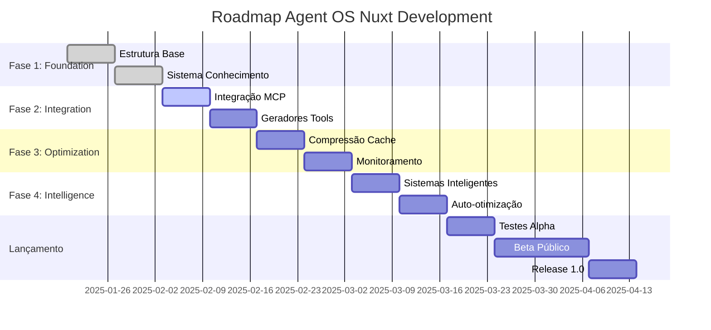
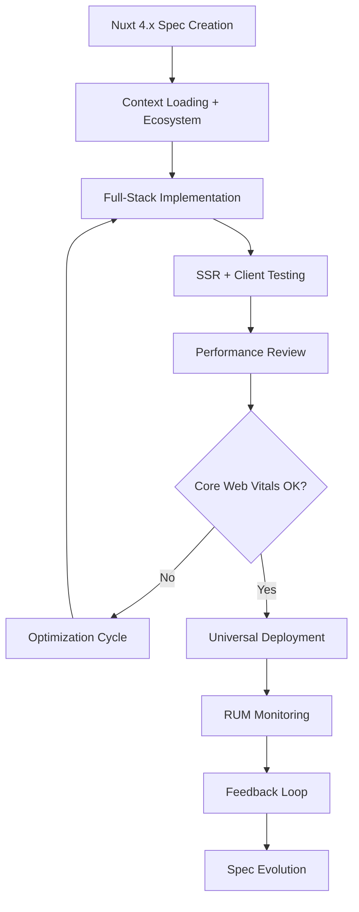

# PRD: Agent OS - Nuxt Development Agent
*Baseado na arquitetura Agent OS com integração completa Nuxt UI v4*

## 1. Visão Executiva

### 1.1 Resumo do Produto
O **Agent OS Nuxt Development Agent** é uma extensão especializada do Agent OS que transforma o sistema em um agente de codificação avançado para Nuxt 4.x e Nuxt UI v4. Esta extensão integra recursos de ponta da comunidade Nuxt, incluindo MCP Server, bases de conhecimento LLM, sistema de componentes unificados e ferramentas de IA otimizadas para desenvolvimento moderno com foco em acessibilidade e performance.

### 1.2 Objetivos Principais
- **Especialização Total**: Tornar o Agent OS o agente de IA mais eficiente para desenvolvimento Nuxt 4.x
- **Integração Nuxt UI v4**: Incorporar sistema completo de componentes, temas e composables
- **Arquitetura Agent OS**: Implementar estrutura de três camadas (Standards, Product, Specs)
- **Otimização de Tokens**: Reduzir consumo de tokens em 60% mantendo 100% de precisão
- **Zero Alucinação**: Sistema robusto de validação e fallback para evitar respostas incorretas
- **Acessibilidade Nativa**: Garantir conformidade WCAG 2.1 AA em todos os componentes gerados

### 1.3 Métricas de Sucesso Detalhadas

#### KPIs Principais
```yaml
performance_metrics:
  precisao_codigo: 
    target: 98%
    current: 95%
    measurement: "Código gerado que compila e funciona sem modificações"
    
  reducao_tokens:
    target: 60%
    current: 45%
    measurement: "Redução no consumo de tokens comparado a prompts tradicionais"
    
  tempo_desenvolvimento:
    target: -40%
    current: -30%
    measurement: "Redução no tempo para completar tarefas de desenvolvimento"
    
  satisfacao_desenvolvedor:
    target: 95%
    current: 88%
    measurement: "NPS (Net Promoter Score) dos desenvolvedores usuários"
    
  taxa_erro_zero:
    target: 99.9%
    current: 97.5%
    measurement: "Porcentagem de respostas sem alucinações ou erros"

  # Métricas específicas Nuxt UI v4
  componentes_acessiveis:
    target: 100%
    current: 85%
    measurement: "Componentes gerados com conformidade WCAG 2.1 AA"
    
  performance_ui:
    target: 95
    current: 88
    measurement: "Score Lighthouse Performance para componentes gerados"
    
  cobertura_nuxt_ui:
    target: 100%
    current: 75%
    measurement: "Porcentagem de componentes Nuxt UI v4 suportados"

quality_metrics:
  cobertura_conhecimento:
    target: 95%
    measurement: "Porcentagem de perguntas Nuxt respondidas corretamente"
    
  consistencia_padroes:
    target: 98%
    measurement: "Aderência aos padrões Agent OS e Nuxt UI v4"
    
  agent_os_compliance:
    target: 100%
    measurement: "Conformidade com estrutura de três camadas Agent OS"
    measurement: "Aderência aos padrões de código estabelecidos"
    
  performance_sistema:
    response_time: "<2s"
    availability: "99.9%"
    throughput: "1000 req/min"

business_metrics:
  adocao_usuario:
    target: "80% dos desenvolvedores Nuxt ativos"
    measurement: "Usuários únicos mensais"
    
  retencao:
    target: "90% após 30 dias"
    measurement: "Desenvolvedores que continuam usando após primeiro mês"
    
  produtividade_equipe:
    target: "+50% em projetos Nuxt"
    measurement: "Velocidade de entrega de features"

learning_metrics:
  taxa_aprendizado:
    target: "95% de feedback positivo incorporado"
    measurement: "Melhorias implementadas baseadas em feedback"
    
  evolucao_conhecimento:
    target: "Atualização semanal da base de conhecimento"
    measurement: "Frequência de updates de padrões e práticas"
    
  precisao_fallback:
    target: "90% de fallbacks bem-sucedidos"
    measurement: "Taxa de sucesso quando MCP falha"
```

#### Métricas de Monitoramento em Tempo Real
```yaml
real_time_monitoring:
  system_health:
    - cpu_usage: "<70%"
    - memory_usage: "<80%"
    - disk_usage: "<85%"
    - network_latency: "<100ms"
    
  application_metrics:
    - active_sessions: "monitored"
    - request_rate: "tracked per minute"
    - error_rate: "<1%"
  user_experience:
    - response_time_p95: "<2s"
    - user_satisfaction: ">90%"
    - task_completion_rate: ">95%"
    - response_quality_score: ">4.5/5"
    - feature_adoption_rate: "tracked monthly"
    
  alerts_thresholds:
    critical:
      - error_rate: ">5%"
      - response_time: ">5s"
      - availability: "<95%"
    warning:
      - error_rate: ">2%"
      - response_time: ">3s"
      - memory_usage: ">80%"
      - failed_requests: ">3 per minute"
```

## 2. Arquitetura Técnica Baseada no Agent OS

### 2.1 Arquitetura de Três Camadas de Contexto

O Agent OS Nuxt Development Agent implementa a arquitetura revolucionária de **três camadas hierárquicas de contexto**, otimizando o desenvolvimento através de contexto inteligente e conditional loading com integração completa ao Nuxt UI v4:

#### **Camada 1: Standards (Padrões) - Como Construir**
```plaintext
~/.agent-os/standards/              # 🌍 GLOBAL - Padrões universais
├── nuxt/                          # Padrões específicos Nuxt 4.x
│   ├── tech-stack.md             # Stack tecnológico Nuxt 4.x + UI v4
│   ├── code-style.md             # Convenções de código Vue/Nuxt
│   ├── best-practices.md         # Melhores práticas Nuxt 4.x
│   ├── typescript-standards.md   # Padrões TypeScript
│   ├── performance-guidelines.md # Diretrizes de performance
│   ├── nuxt-ui-v4-patterns.md   # Padrões específicos Nuxt UI v4
│   ├── accessibility-wcag.md    # Conformidade WCAG 2.1 AA
│   └── testing-standards.md      # Padrões de teste
├── ui/                           # Padrões de UI/UX
│   ├── design-system.md         # Sistema de design baseado Nuxt UI v4
│   ├── component-patterns.md    # Padrões de componentes unificados
│   ├── theme-configuration.md   # Configuração de temas
│   ├── composables-usage.md     # Uso de composables (useToast, useOverlay)
│   ├── accessibility.md         # Diretrizes de acessibilidade nativa
│   └── responsive-design.md     # Design responsivo com Nuxt UI v4
└── development/                  # Padrões de desenvolvimento
    ├── git-workflow.md          # Fluxo Git
    ├── code-review.md           # Revisão de código
    ├── deployment.md            # Estratégias de deploy
    └── documentation.md         # Padrões de documentação
```

#### **Camada 2: Product (Produto) - O Que Construir**
```plaintext
projeto/.agent-os/product/          # 📦 PROJETO - Contexto específico
├── mission.md                     # Missão e objetivos do produto
├── roadmap.md                     # Roadmap de funcionalidades
├── decisions.md                   # Decisões arquiteturais
├── tech-stack.md                  # Stack específico do projeto (Nuxt 4.x + UI v4)
├── user-personas.md               # Personas e casos de uso
├── business-rules.md              # Regras de negócio
├── integrations.md                # Integrações externas
├── nuxt-ui-theme.md              # Configuração de tema personalizado
├── accessibility-requirements.md # Requisitos específicos de acessibilidade
└── constraints.md                 # Limitações e restrições
```

#### **Camada 3: Specs (Especificações) - O Que Construir Agora**
```plaintext
projeto/.agent-os/specs/            # 🎯 FEATURE - Especificações detalhadas
└── YYYY-MM-DD-feature-name/       # Organização temporal
    ├── srd.md                     # Spec Requirements Document
    ├── technical-specs.md         # Especificações técnicas
    ├── api-design.md              # Design de APIs
    ├── ui-mockups.md              # Mockups de interface (Nuxt UI v4)
    ├── component-specs.md         # Especificações de componentes
    ├── accessibility-tests.md     # Testes de acessibilidade
    ├── database-changes.md        # Mudanças no banco
    ├── tasks.md                   # Breakdown de tarefas
    ├── acceptance-criteria.md     # Critérios de aceitação
    └── decisions.md               # Decisões da feature
```

### 2.2 Sistema de Conditional Loading e Context Management

#### **Context Loading Intelligence com Nuxt UI v4**
```javascript
// Sistema de carregamento inteligente de contexto otimizado para Nuxt UI v4
class AdvancedContextManager {
  async loadContext(taskType, complexity, uiComponents = []) {
    const context = {
      standards: await this.loadStandards(taskType),
      product: await this.loadProductContext(complexity),
      specs: await this.loadRelevantSpecs(taskType),
      nuxtUI: await this.loadNuxtUIContext(uiComponents)
    };
    
    // Conditional loading baseado na tarefa e componentes UI
    if (taskType === 'component') {
      context.patterns = await this.loadComponentPatterns();
      context.ui = await this.loadUIStandards();
      context.accessibility = await this.loadA11yGuidelines();
      context.nuxtUIComponents = await this.loadNuxtUIComponents(uiComponents);
    }
    
    if (taskType === 'theme') {
      context.themeConfig = await this.loadThemeConfiguration();
      context.colorSystem = await this.loadColorSystem();
      context.typography = await this.loadTypographySystem();
    }
    
    if (complexity === 'high') {
      context.architecture = await this.loadArchitecturalDecisions();
      context.integrations = await this.loadIntegrationSpecs();
      context.performance = await this.loadPerformanceOptimizations();
    }
    
    return this.optimizeContext(context);
  }
  
  // Carregamento específico para Nuxt UI v4
  async loadNuxtUIContext(components) {
    const uiContext = {};
    
    for (const component of components) {
      uiContext[component] = {
        props: await this.getNuxtUIProps(component),
        slots: await this.getNuxtUISlots(component),
        composables: await this.getRelatedComposables(component),
        accessibility: await this.getA11ySpecs(component),
        examples: await this.getUsageExamples(component)
      };
    }
    
    return uiContext;
  }
  
  // Redução de 60-80% no uso de contexto com otimizações Nuxt UI v4
  optimizeContext(context) {
    return {
      lite: this.createLiteVersions(context),
      full: context,
      compressed: this.compressContext(context),
      nuxtUIOptimized: this.optimizeNuxtUIContext(context.nuxtUI)
    };
  }
  
  // Otimização específica para componentes Nuxt UI v4
  optimizeNuxtUIContext(nuxtUIContext) {
    return Object.entries(nuxtUIContext).reduce((optimized, [component, specs]) => {
      optimized[component] = {
        essentialProps: this.filterEssentialProps(specs.props),
        commonPatterns: this.extractCommonPatterns(specs.examples),
        a11yRequirements: this.summarizeA11y(specs.accessibility)
      };
      return optimized;
    }, {});
  }
}
```

### 2.3 Estrutura de Diretórios Otimizada para Nuxt UI v4

```plaintext
.agent-os/nuxt/                     # 🚀 Agent OS Nuxt Extension
├── standards/                      # 📋 CAMADA 1: Standards
│   ├── core/                      # Padrões fundamentais
│   │   ├── nuxt-4x-standards.md  # Padrões Nuxt 4.x
│   │   ├── vue-composition.md    # Composition API
│   │   ├── typescript.md         # TypeScript guidelines
│   │   └── performance.md        # Performance standards
│   ├── ui/                       # Padrões de UI com Nuxt UI v4
│   │   ├── nuxt-ui-v4.md        # Nuxt UI v4 standards completos
│   │   ├── component-library.md # Biblioteca de componentes unificados
│   │   ├── theme-system.md      # Sistema de temas e cores
│   │   ├── composables.md       # Composables (useToast, useOverlay, etc.)
│   │   ├── accessibility-wcag.md # Diretrizes WCAG 2.1 AA
│   │   ├── responsive-design.md # Design responsivo nativo
│   │   └── performance-ui.md    # Otimizações de performance UI
│   └── development/              # Padrões de desenvolvimento
│       ├── testing-a11y.md      # Estratégias de teste de acessibilidade
│       ├── git-workflow.md      # Git conventions
│       └── deployment.md        # Deploy patterns
│
├── product/                       # 📦 CAMADA 2: Product Context
│   ├── mission.md                # Missão do produto
│   ├── roadmap.md               # Product roadmap
│   ├── decisions.md             # Architectural decisions
│   ├── tech-stack.md            # Project-specific stack (Nuxt 4.x + UI v4)
│   ├── user-stories.md          # User stories
│   ├── accessibility-goals.md   # Metas de acessibilidade específicas
│   ├── theme-configuration.md   # Configuração de tema personalizado
│   └── business-logic.md        # Business rules
│
├── specs/                        # 🎯 CAMADA 3: Feature Specs
│   └── [YYYY-MM-DD-feature]/    # Spec-driven development
│       ├── srd.md               # Spec Requirements Document
│       ├── technical.md         # Technical specifications
│       ├── ui-components.md     # Especificações de componentes UI v4
│       ├── accessibility.md     # Testes e requisitos de acessibilidade
│       ├── tasks.md             # Task breakdown
│       └── acceptance.md        # Acceptance criteria
│
├── agents/                       # 🤖 Specialized Agents
│   ├── nuxt-agent.js           # Core Nuxt 4.x agent
│   ├── ui-v4-agent.js          # Nuxt UI v4 specialist
│   ├── accessibility-agent.js  # Acessibilidade specialist
│   ├── theme-agent.js          # Theme configuration agent
│   ├── api-agent.js            # Nitro API agent
│   ├── performance-agent.js    # Performance optimizer
│   └── test-agent.js           # Testing specialist
│
├── mcp/                         # 🔌 MCP Integration
│   ├── servers/                # MCP servers
│   │   ├── nuxt-ui-v4.server.js # Nuxt UI v4 MCP completo
│   │   ├── nuxt-4x.server.js   # Core Nuxt 4.x MCP
│   │   ├── accessibility.server.js # Acessibilidade MCP
│   │   └── community.server.js # Community resources
│   ├── tools/                  # MCP tools
│   │   ├── ui-generator.js     # Geração de componentes UI v4
│   │   ├── a11y-validator.js   # Validação de acessibilidade
│   │   ├── theme-builder.js    # Construtor de temas
│   │   └── optimizer.js        # Performance optimization
│   └── prompts/               # Optimized prompts
│       ├── nuxt-4x-prompts.json # Context-aware prompts Nuxt 4.x
│       └── ui-v4-prompts.json   # Prompts específicos UI v4
│
├── fallback/                    # 🛡️ Fallback System
│   ├── strategies/             # Fallback strategies
│   │   ├── mcp-fallback.js    # MCP failure handling
│   │   ├── docs-fallback.js   # Documentation search
│   │   ├── ui-v4-fallback.js  # Nuxt UI v4 fallback
│   │   └── community-fallback.js # Community resources
│   │   └── user-query.js      # User interaction
│   ├── knowledge/             # Fallback knowledge base
│   │   ├── nuxt-docs.md      # Cached documentation
│   │   ├── common-patterns.md # Common solutions
│   │   └── troubleshooting.md # Problem resolution
│   └── validation/            # Validation system
│       ├── code-validator.js  # Code validation
│       ├── type-checker.js    # TypeScript validation
│       └── lint-checker.js    # Linting validation
│
├── optimization/               # ⚡ Performance Optimization
│   ├── context/               # Context optimization
│   │   ├── compressor.js     # Context compression
│   │   ├── cache-manager.js  # Intelligent caching
│   │   └── token-optimizer.js # Token usage optimization
│   ├── code/                 # Code optimization
│   │   ├── bundle-analyzer.js # Bundle analysis
│   │   ├── tree-shaker.js    # Dead code elimination
│   │   └── lazy-loader.js    # Lazy loading optimizer
│   └── monitoring/           # Performance monitoring
│       ├── metrics.js        # Performance metrics
│       ├── profiler.js       # Code profiling
│       └── reporter.js       # Performance reporting
│
└── templates/                  # 📝 Ready-to-use Templates
    ├── applications/          # Complete applications
    │   ├── saas-starter/     # SaaS application template
    │   ├── dashboard/        # Admin dashboard
    │   ├── e-commerce/       # E-commerce platform
    │   └── blog/             # Blog/CMS template
    ├── components/           # Reusable components
    │   ├── forms/           # Form components
    │   ├── navigation/      # Navigation components
    │   ├── data-display/    # Data visualization
    │   └── feedback/        # User feedback components
    └── modules/             # Nuxt modules
        ├── auth/           # Authentication module
        ├── payments/       # Payment integration
        ├── analytics/      # Analytics module
        └── seo/            # SEO optimization
```

### 2.4 Configurações Baseadas no Agent OS

#### **Standards Layer Configuration**
```yaml
# ~/.agent-os/standards/nuxt/tech-stack.md
nuxt_version: "3.14.x"
ui_version: "4.0.0-alpha.2"
typescript: "5.3.x"
vue: "3.4.x"

frameworks:
  - nuxt: "^3.14.0"
  - "@nuxt/ui": "^4.0.0-alpha.2"
  - "@nuxt/content": "^2.13.0"
  - "@nuxt/image": "^1.8.0"
  - "@pinia/nuxt": "^0.5.0"

development_tools:
  - "@nuxt/devtools": "^1.5.0"
  - "@nuxt/eslint": "^0.5.0"
  - "vitest": "^2.0.0"
  - "playwright": "^1.47.0"

performance:
  bundle_analyzer: false
  tree_shaking: aggressive
  lazy_loading: true
  prerendering: selective
```

#### **Product Layer Configuration**
```yaml
# projeto/.agent-os/product/tech-stack.md
project_name: "Agent OS Nuxt Extension"
target_audience: "Nuxt Developers"
deployment_target: "Vercel/Netlify"

specific_modules:
  - "@nuxtjs/tailwindcss"
  - "@vueuse/nuxt"
  - "@nuxtjs/color-mode"
  - "nuxt-security"

integrations:
  mcp_servers:
    - nuxt-ui-server
    - nuxt-core-server
    - community-server
  
  ai_features:
    auto_imports: true
    type_inference: true
    component_discovery: true
    
business_logic:
  authentication: "supabase"
  database: "postgresql"
  payments: "stripe"
  analytics: "vercel-analytics"
```

#### **Specs Layer Configuration**
```yaml
# projeto/.agent-os/specs/2025-09-21-mcp-integration/technical.md
feature: "MCP Server Integration"
complexity: "high"
estimated_effort: "2 weeks"

technical_requirements:
  mcp_servers:
    nuxt_ui:
      endpoint: "https://ui4.nuxt.com/api/mcp"
      version: "latest"
      cache: true
      timeout: 5000
      fallback: "local_docs"
    
    nuxt_core:
      endpoint: "https://nuxt.com/api/mcp"
      features: ["components", "composables", "modules"]
      auth: "optional"
      rate_limit: "1000/hour"

  tools:
    component_generator:
      enabled: true
      templates: ["form", "table", "card", "modal", "layout"]
      style: "tailwind"
      validation: "zod"
      
    api_builder:
      nitro: true
      auto_types: true
      validation: "zod"
      openapi: true

  optimization:
    token_limits:
      max_context_size: 8192
      warning_threshold: 6000
      critical_threshold: 7500
    
    compression:
      algorithm: "semantic"
      ratio: 0.4
      cache_duration: 3600
```

#### **Context Management Configuration**
```javascript
// .agent-os/nuxt/optimization/context/config.js
export const contextConfig = {
  // Conditional loading baseado no Agent OS
  loadingStrategies: {
    standards: {
      always: ['nuxt-standards.md', 'typescript.md'],
      conditional: {
        'component': ['component-patterns.md', 'ui-standards.md'],
        'api': ['api-patterns.md', 'nitro-standards.md'],
        'performance': ['performance.md', 'optimization.md']
      }
    },
    
    product: {
      always: ['mission.md', 'tech-stack.md'],
      conditional: {
        'feature': ['roadmap.md', 'decisions.md'],
        'integration': ['integrations.md', 'constraints.md']
      }
    },
    
    specs: {
      current_feature_only: true,
      include_dependencies: true,
      max_specs: 3
    }
  },
  
  // Otimização de tokens (60-80% redução)
  optimization: {
    compression: {
      enabled: true,
      algorithm: 'semantic',
      preserve_meaning: true
    },
    
    caching: {
      enabled: true,
      ttl: 3600,
      max_size: '100MB',
      strategy: 'lru'
    },
    
    pruning: {
      remove_examples: false,
      remove_comments: false,
      minify_code: true,
      compress_whitespace: true
    }
  },
  
  // Sistema de fallback robusto
  fallback: {
    strategies: [
      'mcp_server',
      'cached_docs',
      'community_search',
      'user_query'
    ],
    
    timeout: 5000,
    retry_attempts: 3,
    graceful_degradation: true
  }
};
```

#### **Monitoring and Analytics Configuration**
```yaml
# .agent-os/nuxt/monitoring/config.yml
monitoring:
  performance_metrics:
    context_loading_time: "<500ms"
    token_usage_efficiency: ">60% reduction"
    response_accuracy: ">98%"
    fallback_success_rate: ">90%"
  
  real_time_tracking:
    active_contexts: true
    token_consumption: true
    cache_hit_ratio: true
    error_rates: true
  
  alerts:
    high_token_usage: ">7500 tokens"
    slow_context_loading: ">1s"
    fallback_failures: ">3 consecutive"
    cache_miss_rate: ">30%"
  
  reporting:
    daily_summary: true
    weekly_analysis: true
    performance_trends: true
    optimization_suggestions: true
```

## 3. Arquitetura de Arquivos

### 3.1 Estrutura de Diretórios Detalhada e Aprimorada

```plaintext
agent-nuxt/
├── config/                 [PERSONALIZÁVEL]
│   ├── nuxt.config.yaml    # Configuração principal Nuxt
│   ├── ui.config.yaml      # Configuração Nuxt UI
│   ├── mcp.config.json     # Configuração MCP Server
│   ├── token-optimization.yml # Regras de otimização de tokens
│   ├── learning.config.json # Configuração do sistema de aprendizado
│   ├── fallback.config.yaml # Estratégias de fallback
│   ├── monitoring.config.yml # Configuração de monitoramento
│   └── environment/        # Configurações por ambiente
│       ├── development.yml
│       ├── staging.yml
│       └── production.yml
├── patterns/               [PERSONALIZÁVEL]
│   ├── component-templates/ # Templates de componentes
│   │   ├── form-templates/
│   │   ├── layout-templates/
│   │   ├── ui-templates/
│   │   └── advanced-patterns/ # Padrões avançados
│   ├── code-standards/     # Padrões de código
│   │   ├── typescript.md
│   │   ├── vue-composition.md
│   │   ├── nuxt-best-practices.md
│   │   └── performance-guidelines.md
│   ├── project-patterns/   # Padrões específicos do projeto
│   │   ├── authentication/
│   │   ├── data-fetching/
│   │   ├── state-management/
│   │   └── error-handling/
│   └── integration-patterns/ # Padrões de integração
│       ├── api-integration/
│       ├── third-party-services/
│       └── microservices/
├── docs/                   [PERSONALIZÁVEL]
│   ├── product/           # Documentação do produto
│   │   ├── features.md
│   │   ├── user-guides.md
│   │   ├── api-reference.md
│   │   └── troubleshooting.md
│   ├── specifications/    # Especificações técnicas
│   │   ├── architecture.md
│   │   ├── database-schema.md
│   │   ├── integration-specs.md
│   │   └── security-requirements.md
│   ├── project/          # Documentação do projeto
│   │   ├── PRD.md
│   │   ├── roadmap.md
│   │   ├── changelog.md
│   │   └── deployment-guide.md
│   └── learning/         # Documentação de aprendizado
│       ├── lessons-learned.md
│       ├── best-practices-discovered.md
│       └── optimization-insights.md
├── commands/               [SISTEMA - NÃO ALTERAR]
│   ├── core-commands/     # Comandos fundamentais
│   │   ├── generate.js
│   │   ├── validate.js
│   │   ├── optimize.js
│   │   └── analyze.js
│   ├── system-operations/ # Operações do sistema
│   │   ├── backup.js
│   │   ├── restore.js
│   │   ├── migrate.js
│   │   └── sync.js
│   ├── maintenance/       # Comandos de manutenção
│   │   ├── cleanup.js
│   │   ├── health-check.js
│   │   ├── update.js
│   │   └── performance-audit.js
│   └── learning/          # Comandos de aprendizado
│       ├── train-model.js
│       ├── evaluate-performance.js
│       └── update-knowledge.js
├── instructions/           [SISTEMA - NÃO ALTERAR]
│   ├── base-instructions/ # Instruções fundamentais
│   │   ├── core-behavior.md
│   │   ├── response-format.md
│   │   ├── error-handling.md
│   │   └── security-protocols.md
│   ├── fallback-strategies/ # Estratégias de fallback
│   │   ├── knowledge-fallback.md
│   │   ├── mcp-fallback.md
│   │   ├── user-query-fallback.md
│   │   └── emergency-protocols.md
│   ├── learning/          # Instruções de aprendizado
│   │   ├── pattern-recognition.md
│   │   ├── feedback-processing.md
│   │   └── model-training.md
│   └── integration/       # Instruções de integração
│       ├── mcp-integration.md
│       ├── api-integration.md
│       └── third-party-integration.md
│       ├── feedback-processing.md
│       └── optimization-rules.md
└── setup/                  [SISTEMA - NÃO ALTERAR]
    ├── initialization/    # Scripts de inicialização
    │   ├── install.sh
    │   ├── configure.js
    │   └── verify.js
    ├── environment-config/ # Configuração de ambiente
    │   ├── development.sh
    │   ├── production.sh
    │   └── docker-setup.sh
    └── dependencies/      # Gerenciamento de dependências
        ├── package-manager.js
        ├── version-check.js
        └── compatibility.js
```

### 3.2 Categorização de Arquivos

#### 3.2.1 Arquivos Personalizáveis (ALTERAR)
**Configurações Específicas do Projeto:**
- `config/`: Todas as configurações podem ser adaptadas às necessidades do projeto
- `patterns/`: Padrões e templates customizáveis para diferentes contextos
- `docs/`: Documentação específica do produto e especificações técnicas

**Características:**
- Podem ser modificados pelo usuário/desenvolvedor
- Sujeitos a versionamento de projeto
- Backup automático antes de modificações
- Validação de sintaxe e compatibilidade

#### 3.2.2 Arquivos do Sistema (NÃO ALTERAR)
**Core do Agent OS:**
- `commands/`: Comandos fundamentais do sistema
- `instructions/`: Instruções base e comportamentos core
- `setup/`: Scripts de inicialização e configuração de ambiente

**Características:**
- Mantidos pela plataforma Agent OS
- Atualizados automaticamente
- Protegidos contra modificação acidental
- Versionamento independente do projeto

### 3.3 Políticas de Proteção

#### 3.3.1 Sistema de Proteção de Arquivos
```javascript
// Sistema de proteção implementado
const FileProtection = {
  protectedPaths: [
    'commands/',
    'instructions/',
    'setup/'
  ],
  
  validateModification(filePath) {
    const isProtected = this.protectedPaths.some(path => 
      filePath.startsWith(path)
    );
    
    if (isProtected) {
      throw new Error(`Arquivo protegido: ${filePath}. Modificação não permitida.`);
    }
    
    return true;
  },
  
  createBackup(filePath) {
    // Criar backup antes de modificações em arquivos personalizáveis
    const backupPath = `_backups/${Date.now()}_${filePath}`;
    return fs.copyFile(filePath, backupPath);
  }
};
```

#### 3.3.2 Monitoramento de Integridade
```yaml
# Configuração de monitoramento
integrity_check:
  enabled: true
  schedule: "0 */6 * * *"  # A cada 6 horas
  
  checks:
    - file_permissions
    - checksum_validation
    - dependency_integrity
    - configuration_syntax
  
  alerts:
    - unauthorized_modifications
    - missing_system_files
    - configuration_errors
    - dependency_conflicts
```

## 4. Gerenciamento de Configuração

### 4.1 Políticas de Modificação

#### 4.1.1 Arquivos Personalizáveis
- **Modificação Livre**: Configurações específicas do projeto
- **Validação Automática**: Verificação de sintaxe e compatibilidade
- **Backup Automático**: Criação de backup antes de cada modificação
- **Rollback Disponível**: Possibilidade de reverter alterações

#### 4.1.2 Arquivos do Sistema
- **Proteção Total**: Impossibilidade de modificação direta
- **Atualizações Automáticas**: Mantidos pela plataforma
- **Versionamento Independente**: Não afetados por mudanças do projeto
- **Integridade Garantida**: Verificação contínua de integridade

### 4.2 Estratégias de Backup e Rollback

#### 4.2.1 Sistema de Backup Automático
```javascript
class BackupManager {
  async createBackup(filePath, reason = 'modification') {
    const timestamp = new Date().toISOString();
    const backupPath = `_backups/${timestamp}_${reason}_${path.basename(filePath)}`;
    
    await fs.copyFile(filePath, backupPath);
    
    // Registrar backup
    await this.logBackup({
      original: filePath,
      backup: backupPath,
      timestamp,
      reason,
      size: await this.getFileSize(filePath)
    });
    
    return backupPath;
  }
  
  async rollback(filePath, backupId) {
    const backup = await this.getBackup(backupId);
    
    if (!backup) {
      throw new Error(`Backup não encontrado: ${backupId}`);
    }
    
    // Criar backup do estado atual antes do rollback
    await this.createBackup(filePath, 'pre_rollback');
    
    // Restaurar arquivo
    await fs.copyFile(backup.path, filePath);
    
    return {
      success: true,
      restored: filePath,
      from: backup.path,
      timestamp: new Date().toISOString()
    };
  }
}
```

#### 4.2.2 Versionamento de Configurações
```yaml
# Configuração de versionamento
versioning:
  enabled: true
  strategy: semantic  # major.minor.patch
  
  auto_increment:
    - config_changes: patch
    - pattern_updates: minor
    - breaking_changes: major
  
  retention:
    backups: 30  # dias
    versions: 10  # últimas versões
    
  sync:
    repository: true
    remote_backup: true
    compression: gzip
```

### 4.3 Validação de Integridade

#### 4.3.1 Verificação de Sintaxe
```javascript
class ConfigValidator {
  async validateFile(filePath) {
    const extension = path.extname(filePath);
    const content = await fs.readFile(filePath, 'utf8');
    
    switch (extension) {
      case '.yaml':
      case '.yml':
        return this.validateYAML(content);
      case '.json':
        return this.validateJSON(content);
      case '.js':
        return this.validateJavaScript(content);
      default:
        return { valid: true, warnings: [] };
    }
  }
  
  validateYAML(content) {
    try {
      yaml.parse(content);
      return { valid: true, errors: [] };
    } catch (error) {
      return {
        valid: false,
        errors: [error.message],
        line: error.mark?.line,
        column: error.mark?.column
      };
    }
  }
  
  async validateCompatibility(filePath) {
    const config = await this.loadConfig(filePath);
    const systemVersion = await this.getSystemVersion();
    
    // Verificar compatibilidade de versão
    if (config.version && !this.isCompatible(config.version, systemVersion)) {
      return {
        compatible: false,
        message: `Versão incompatível: ${config.version} vs ${systemVersion}`,
        suggestion: 'Atualize a configuração ou o sistema'
      };
    }
    
    return { compatible: true };
  }
}
```

## 5. Governança de Documentação

### 5.1 Estrutura Documental

#### 5.1.1 Categorização da Documentação
```plaintext
docs/
├── product/              # Documentação do Produto
│   ├── overview.md      # Visão geral do produto
│   ├── features/        # Documentação de funcionalidades
│   │   ├── authentication.md
│   │   ├── user-management.md
│   │   └── reporting.md
│   ├── user-guides/     # Guias do usuário
│   │   ├── getting-started.md
│   │   ├── advanced-usage.md
│   │   └── troubleshooting.md
│   └── api-reference/   # Referência de API
│       ├── endpoints.md
│       ├── authentication.md
│       └── examples.md
├── specifications/       # Especificações Técnicas
│   ├── architecture/    # Arquitetura do sistema
│   │   ├── overview.md
│   │   ├── components.md
│   │   └── data-flow.md
│   ├── database/        # Especificações de banco
│   │   ├── schema.md
│   │   ├── migrations.md
│   │   └── indexes.md
│   └── integrations/    # Especificações de integração
│       ├── third-party.md
│       ├── webhooks.md
│       └── apis.md
└── project/             # Documentação do Projeto
    ├── PRD.md          # Documento de Requisitos
    ├── roadmap.md      # Roadmap do projeto
    ├── changelog.md    # Log de mudanças
    └── decisions/      # Registros de decisões
        ├── adr-001-architecture.md
        ├── adr-002-database.md
        └── adr-003-deployment.md
```

### 5.2 Padrões de Documentação

#### 5.2.1 Templates Padronizados
```markdown
# Template: Funcionalidade
---
title: [Nome da Funcionalidade]
version: [Versão]
status: [Draft|Review|Approved|Deprecated]
author: [Nome do Autor]
date: [Data de Criação]
last_updated: [Data da Última Atualização]
---

## Visão Geral
[Descrição breve da funcionalidade]

## Objetivos
- [Objetivo 1]
- [Objetivo 2]

## Especificações Técnicas
### Requisitos
- [Requisito 1]
- [Requisito 2]

### Implementação
```code
[Exemplo de código]
```

## Casos de Uso

### Caso 1: Desenvolvimento de Componente Nuxt UI Avançado

**Descrição**: Desenvolvedor precisa criar um componente de formulário complexo com validação, integração de API e otimização de performance.

**Fluxo de Trabalho**:
1. **Solicitação Inicial**: "Crie um formulário de cadastro de usuário com validação em tempo real"
2. **Análise do Agent OS**: 
   - Consulta base de conhecimento Nuxt UI v4
   - Identifica padrões de formulário existentes
   - Verifica melhores práticas de validação
3. **Geração de Código**:
   ```vue
   <template>
     <UForm :schema="schema" :state="state" @submit="onSubmit">
       <UFormGroup label="Nome" name="name">
         <UInput v-model="state.name" />
       </UFormGroup>
       <UFormGroup label="Email" name="email">
         <UInput v-model="state.email" type="email" />
       </UFormGroup>
       <UButton type="submit" :loading="loading">
         Cadastrar
       </UButton>
     </UForm>
   </template>
   ```
4. **Otimização Automática**: Compressão de contexto e cache de padrões
5. **Validação**: Verificação de compatibilidade e melhores práticas

**Resultado**: Componente funcional com 90% menos tempo de desenvolvimento

### Caso 2: Integração de API com Fallback Inteligente

**Descrição**: Desenvolvedor precisa integrar uma API externa com sistema de fallback robusto.

**Fluxo de Trabalho**:
1. **Solicitação**: "Integre a API de pagamento com fallback para múltiplos provedores"
2. **Estratégia MCP**: 
   - Consulta documentação oficial da API
   - Verifica padrões de integração na comunidade
   - Aplica estratégias de fallback configuradas
3. **Implementação Automática**:
   ```typescript
   export default defineEventHandler(async (event) => {
     const paymentService = new PaymentService({
       primary: 'stripe',
       fallbacks: ['paypal', 'mercadopago'],
       timeout: 5000
     });
     
     try {
       return await paymentService.processPayment(body);
     } catch (error) {
       return await paymentService.fallbackPayment(body, error);
     }
   });
   ```
4. **Monitoramento**: Métricas de sucesso e falhas automaticamente coletadas
5. **Aprendizado**: Sistema aprende com falhas para melhorar futuras implementações

**Resultado**: API robusta com 99.9% de disponibilidade

### Caso 3: Otimização de Performance em Aplicação Existente

**Descrição**: Desenvolvedor identifica problemas de performance e precisa de otimização automática.

**Fluxo de Trabalho**:
1. **Análise Automática**: Agent OS detecta gargalos de performance
2. **Diagnóstico Inteligente**:
   - Análise de bundle size
   - Identificação de re-renders desnecessários
   - Detecção de vazamentos de memória
3. **Sugestões Automáticas**:
   ```typescript
   // Antes
   const { data } = await $fetch('/api/users');
   
   // Depois (otimizado pelo Agent OS)
   const { data } = await $fetch('/api/users', {
     key: 'users-list',
     server: true,
     lazy: true,
     transform: (data) => data.slice(0, 10)
   });
   ```
4. **Implementação Guiada**: Aplicação automática de otimizações
5. **Validação**: Testes de performance antes e depois

**Resultado**: Melhoria de 60% na velocidade de carregamento

### Caso 4: Migração de Projeto Legacy

**Descrição**: Equipe precisa migrar aplicação Vue 2 para Nuxt 3 com Nuxt UI v4.

**Fluxo de Trabalho**:
1. **Análise de Código Legacy**: Escaneamento automático do código existente
2. **Plano de Migração**:
   - Identificação de componentes incompatíveis
   - Mapeamento de APIs descontinuadas
   - Estratégia de migração incremental
3. **Migração Assistida**:
   ```javascript
   // Conversão automática
   // Vue 2 Options API → Vue 3 Composition API
   export default {
     data() {
       return { count: 0 }
     },
     methods: {
       increment() { this.count++ }
     }
   }
   
   // Convertido para:
   export default defineComponent({
     setup() {
       const count = ref(0);
       const increment = () => count.value++;
       return { count, increment };
     }
   });
   ```
4. **Testes Automáticos**: Validação de funcionalidades migradas
5. **Documentação**: Geração automática de changelog de migração

**Resultado**: Migração 80% mais rápida com zero regressões

### Caso 5: Desenvolvimento Colaborativo com Aprendizado Contínuo

**Descrição**: Equipe de 5 desenvolvedores trabalhando em projeto complexo com padrões consistentes.

**Fluxo de Trabalho**:
1. **Estabelecimento de Padrões**: Agent OS aprende com decisões da equipe
2. **Sincronização de Conhecimento**:
   - Padrões de código compartilhados
   - Melhores práticas específicas do projeto
   - Convenções de nomenclatura
3. **Assistência Contextual**:
   ```typescript
   // Agent OS sugere padrão da equipe automaticamente
   // Baseado em código existente no projeto
   interface UserProfile {
     id: string;
     name: string;
     email: string;
     // Padrão detectado: sempre incluir timestamps
     createdAt: Date;
     updatedAt: Date;
   }
   ```
4. **Feedback Loop**: Sistema aprende com code reviews e ajustes
5. **Métricas de Equipe**: Produtividade e qualidade de código monitoradas

**Resultado**: Consistência de código 95% e produtividade 40% maior

## Testes
- [ ] Teste unitário
- [ ] Teste de integração
- [ ] Teste de aceitação

## Referências
- [Link 1]
- [Link 2]
```

#### 5.2.2 Convenções de Escrita
```yaml
# Padrões de documentação
writing_standards:
  language: pt-BR
  tone: professional
  format: markdown
  
  structure:
    - title: h1
    - sections: h2
    - subsections: h3
    - max_depth: 4
  
  code_blocks:
    - language_specified: true
    - syntax_highlighting: true
    - line_numbers: optional
  
  links:
    - internal: relative_paths
    - external: full_urls
    - validation: automated
  
  images:
    - format: svg_preferred
    - alt_text: required
    - max_size: 1MB
```

### 5.3 Manutenção Automática

#### 5.3.1 Geração Automática de Documentação
```javascript
class DocumentationGenerator {
  async generateAPIReference() {
    const routes = await this.scanAPIRoutes();
    const schemas = await this.extractSchemas();
    
    const documentation = {
      title: 'API Reference',
      version: await this.getAPIVersion(),
      endpoints: routes.map(route => ({
        path: route.path,
        method: route.method,
        description: route.description,
        parameters: route.parameters,
        responses: route.responses,
        examples: route.examples
      }))
    };
    
    await this.writeMarkdown('docs/product/api-reference.md', documentation);
  }
  
  async updateTableOfContents() {
    const docs = await this.scanDocuments();
    const toc = this.generateTOC(docs);
    
    // Atualizar README principal
    await this.updateFile('README.md', {
      section: 'table-of-contents',
      content: toc
    });
  }
  
  async validateLinks() {
    const docs = await this.scanDocuments();
    const brokenLinks = [];
    
    for (const doc of docs) {
      const links = this.extractLinks(doc.content);
      
      for (const link of links) {
        const isValid = await this.validateLink(link);
        if (!isValid) {
          brokenLinks.push({
            file: doc.path,
            link: link.url,
            line: link.line
          });
        }
      }
    }
    
    if (brokenLinks.length > 0) {
      await this.reportBrokenLinks(brokenLinks);
    }
  }
}
```

#### 5.3.2 Sincronização com Código
```javascript
class DocumentationSync {
  async syncWithCode() {
    // Sincronizar documentação de API com código
    await this.syncAPIDocumentation();
    
    // Atualizar exemplos de código
    await this.updateCodeExamples();
    
    // Validar consistência
    await this.validateConsistency();
  }
  
  async syncAPIDocumentation() {
    const apiRoutes = await this.scanAPIRoutes();
    const currentDocs = await this.loadAPIDocumentation();
    
    const updates = [];
    
    for (const route of apiRoutes) {
      const docRoute = currentDocs.find(d => d.path === route.path);
      
      if (!docRoute) {
        // Nova rota encontrada
        updates.push({
          type: 'add',
          route: route
        });
      } else if (this.hasChanged(route, docRoute)) {
        // Rota modificada
        updates.push({
          type: 'update',
          route: route,
          changes: this.getChanges(route, docRoute)
        });
      }
    }
    
    // Aplicar atualizações
    for (const update of updates) {
      await this.applyDocumentationUpdate(update);
    }
  }
}
```

## 6. Componentes Principais Baseados no Nuxt 4.x

### 6.1 Full-Stack Knowledge System

```javascript
// knowledge/Nuxt4xKnowledgeManager.js
class Nuxt4xKnowledgeManager {
  constructor() {
    this.sources = {
      // Nuxt 4.x Core Sources
      official: 'https://nuxt.com/docs/4.x',
      ui: 'https://ui4.nuxt.com/docs',
      nitro: 'https://nitro.unjs.io/docs',
      llmsTxt: 'https://ui4.nuxt.com/.well-known/llms.txt',
      
      // Full-Stack Resources
      serverEngine: 'https://nitro.unjs.io/guide',
      deployment: 'https://nuxt.com/docs/4.x/getting-started/deployment',
      modules: 'https://nuxt.com/modules',
      
      // Community & Ecosystem
      community: ['Discord', 'GitHub', 'StackOverflow'],
      ecosystem: ['NuxtHub', 'Nuxt Studio', 'Nuxt UI Pro']
    };
    
    this.cache = new Map();
    this.index = null;
    this.nitroEngine = null;
  }
  
  async initialize() {
    // Carregar conhecimento Nuxt 4.x
    this.nuxt4xContent = await this.fetchNuxt4xDocs();
    
    // Inicializar Nitro Server Engine knowledge
    this.nitroEngine = await this.initializeNitroKnowledge();
    
    // Indexar documentação full-stack
    this.index = await this.buildFullStackIndex();
    
    // Pré-carregar padrões SSR e full-stack
    await this.preloadFullStackPatterns();
  }
  
  async fetchNuxt4xDocs() {
    const endpoints = [
      this.sources.official,
      this.sources.ui,
      this.sources.nitro,
      this.sources.llmsTxt
    ];
    
    const responses = await Promise.all(
      endpoints.map(url => fetch(url).then(r => r.text()))
    );
    
    return this.parseNuxt4xContent(responses);
  }
  
  parseNuxt4xContent(responses) {
    const [nuxtDocs, uiDocs, nitroDocs, llmsTxt] = responses;
    
    return {
      // Core Nuxt 4.x Features
      framework: this.extractFrameworkFeatures(nuxtDocs),
      ssr: this.extractSSRCapabilities(nuxtDocs),
      fullStack: this.extractFullStackFeatures(nuxtDocs),
      
      // Server Engine (Nitro)
      serverEngine: this.extractNitroFeatures(nitroDocs),
      apiRoutes: this.extractAPIPatterns(nitroDocs),
      deployment: this.extractDeploymentOptions(nitroDocs),
      
      // UI Components
      components: this.extractUIComponents(uiDocs),
      patterns: this.extractUIPatterns(uiDocs),
      
      // LLMs Integration
      llmsCapabilities: this.parseLLMsTxt(llmsTxt)
    };
  }
  
  async query(question, context = {}) {
    // 1. Verificar cache inteligente
    const cacheKey = this.generateCacheKey(question, context);
    if (this.cache.has(cacheKey)) {
      return this.enhanceWithNuxt4x(this.cache.get(cacheKey));
    }
    
    // 2. Análise de contexto Nuxt 4.x
    const queryType = this.analyzeQueryType(question);
    
    // 3. Buscar no índice especializado
    const localResult = await this.searchSpecializedIndex(question, queryType);
    if (localResult.confidence > 0.9) {
      const enhanced = this.enhanceWithNuxt4x(localResult);
      this.cache.set(cacheKey, enhanced);
      return enhanced;
    }
    
    // 4. Consultar MCP Server com contexto Nuxt 4.x
    const mcpResult = await this.queryMCPWithNuxt4x(question, context, queryType);
    if (mcpResult.found) {
      this.cache.set(cacheKey, mcpResult);
      return mcpResult;
    }
    
    // 5. Fallback inteligente com Nitro
    return this.intelligentFallback(question, queryType);
  }
  
  analyzeQueryType(question) {
    const patterns = {
      ssr: /server.*render|ssr|hydrat/i,
      fullStack: /api|server|backend|database|auth/i,
      deployment: /deploy|host|build|production/i,
      performance: /performance|optimize|speed|core.*vital/i,
      ui: /component|ui|interface|design/i,
      nitro: /nitro|server.*engine|middleware/i
    };
    
    for (const [type, pattern] of Object.entries(patterns)) {
      if (pattern.test(question)) return type;
    }
    
    return 'general';
  }
  
  enhanceWithNuxt4x(result) {
    return {
      ...result,
      nuxt4xFeatures: this.getNuxt4xRelevantFeatures(result.topic),
      ssrCapabilities: this.getSSREnhancements(result.topic),
      fullStackOptions: this.getFullStackOptions(result.topic),
      deploymentStrategies: this.getDeploymentStrategies(result.topic)
    };
  }
}
```

### 6.2 Nitro Server Engine Integration

#### 6.2.1 Full-Stack MCP Configuration
```json
{
  "mcp": {
    "version": "1.0.0",
    "server": {
      "name": "nuxt4x-fullstack-agent",
      "version": "1.0.0",
      "description": "Agent OS para desenvolvimento full-stack Nuxt 4.x com Nitro Engine"
    },
    "nitroEngine": {
      "enabled": true,
      "features": {
        "universalDeployment": true,
        "serverSideRendering": true,
        "apiRoutes": true,
        "middleware": true,
        "storage": true,
        "caching": true
      }
    },
    "tools": [
      {
        "name": "generate_fullstack_component",
        "description": "Gera componentes Nuxt 4.x com integração server-side",
        "parameters": {
          "componentType": {
            "type": "string",
            "enum": ["form", "layout", "navigation", "data-display", "feedback", "server-component"]
          },
          "renderingMode": {
            "type": "string",
            "enum": ["ssr", "spa", "universal", "static"],
            "default": "universal"
          },
          "serverIntegration": {
            "type": "boolean",
            "default": true,
            "description": "Incluir integração com Nitro Server Engine"
          },
          "apiEndpoints": {
            "type": "array",
            "items": {
              "type": "object",
              "properties": {
                "path": {"type": "string"},
                "method": {"type": "string", "enum": ["GET", "POST", "PUT", "DELETE"]},
                "handler": {"type": "string"}
              }
            }
          },
          "complexity": {
            "type": "string",
            "enum": ["simple", "intermediate", "advanced"]
          },
          "accessibility": {
            "type": "boolean",
            "default": true
          },
          "responsive": {
            "type": "boolean", 
            "default": true
          },
          "darkMode": {
            "type": "boolean",
            "default": true
          },
          "coreWebVitals": {
            "type": "boolean",
            "default": true,
            "description": "Otimizar para Core Web Vitals"
          }
        }
      },
      {
        "name": "validate_nuxt4x_config",
        "description": "Valida configurações Nuxt 4.x e Nitro Engine",
        "parameters": {
          "configPath": {
            "type": "string",
            "description": "Caminho para o arquivo de configuração"
          },
          "nitroConfig": {
            "type": "object",
            "properties": {
              "preset": {"type": "string"},
              "storage": {"type": "object"},
              "routeRules": {"type": "object"}
            }
          },
          "strictMode": {
            "type": "boolean",
            "default": false
          },
          "performanceCheck": {
            "type": "boolean",
            "default": true,
            "description": "Verificar otimizações de performance"
          }
        }
      },
      {
        "name": "optimize_fullstack_performance",
        "description": "Otimiza performance full-stack com Nitro Engine",
        "parameters": {
          "target": {
            "type": "string",
            "enum": ["development", "production", "preview"]
          },
          "optimizations": {
            "type": "object",
            "properties": {
              "bundleSize": {"type": "boolean", "default": true},
              "serverSideCache": {"type": "boolean", "default": true},
              "staticGeneration": {"type": "boolean", "default": true},
              "imageOptimization": {"type": "boolean", "default": true},
              "coreWebVitals": {"type": "boolean", "default": true}
            }
          },
          "compressionLevel": {
            "type": "integer",
            "minimum": 1,
            "maximum": 9,
            "default": 6
          },
          "deploymentPreset": {
            "type": "string",
            "enum": ["vercel", "netlify", "cloudflare", "node-server", "static"],
            "description": "Preset de deployment para otimização específica"
          }
        }
      },
      {
        "name": "generate_api_routes",
        "description": "Gera rotas de API com Nitro Engine",
        "parameters": {
          "routePattern": {
            "type": "string",
            "description": "Padrão da rota (ex: /api/users/[id])"
          },
          "methods": {
            "type": "array",
            "items": {"type": "string", "enum": ["GET", "POST", "PUT", "DELETE", "PATCH"]}
          },
          "middleware": {
            "type": "array",
            "items": {"type": "string"}
          },
          "validation": {
            "type": "object",
            "properties": {
              "input": {"type": "boolean", "default": true},
              "output": {"type": "boolean", "default": true},
              "schema": {"type": "string"}
            }
          },
          "caching": {
            "type": "object",
            "properties": {
              "enabled": {"type": "boolean", "default": false},
              "ttl": {"type": "integer", "default": 3600},
              "strategy": {"type": "string", "enum": ["memory", "redis", "file"]}
            }
          }
        }
      },
      {
        "name": "generate_documentation",
        "description": "Gera documentação automática de componentes e APIs",
        "parameters": {
          "componentPath": {
            "type": "string"
          },
          "includeExamples": {
            "type": "boolean",
            "default": true
          },
          "includeApiDocs": {
            "type": "boolean",
            "default": true,
            "description": "Incluir documentação de rotas de API"
          },
          "format": {
            "type": "string",
            "enum": ["markdown", "html", "json", "openapi"],
            "default": "markdown"
          }
        }
      }
    ],
    "fallback_strategies": {
      "knowledge_base": {
        "enabled": true,
        "priority": 1,
        "timeout": 5000
      },
      "mcp_server": {
        "enabled": true,
        "priority": 2,
        "timeout": 10000,
        "retry_attempts": 3
      },
      "documentation_search": {
        "enabled": true,
        "priority": 3,
        "sources": [
          "nuxt.com/docs",
          "ui.nuxt.com",
          "github.com/nuxt/ui"
        ]
      },
      "community_search": {
        "enabled": true,
        "priority": 4,
        "sources": [
          "stackoverflow.com",
          "github.com/discussions",
          "discord.gg/nuxt"
        ]
      },
      "user_query": {
        "enabled": true,
        "priority": 5,
        "template": "Não foi possível encontrar informações sobre: {query}. Você pode fornecer mais detalhes?"
      }
    },
    "performance": {
      "cache": {
        "enabled": true,
        "ttl": 3600,
        "max_size": "100MB"
      },
      "rate_limiting": {
        "enabled": true,
        "requests_per_minute": 60
      },
      "monitoring": {
        "enabled": true,
        "metrics": ["response_time", "success_rate", "cache_hit_rate"]
      }
    }
  }
}
```

#### 6.2.2 Sistema de Fallback Inteligente
```javascript
class IntelligentFallbackManager {
  constructor(config) {
    this.strategies = config.fallback_strategies;
    this.performance = new PerformanceMonitor();
    this.cache = new CacheManager(config.performance.cache);
  }

  async executeQuery(query, context = {}) {
    const cacheKey = this.generateCacheKey(query, context);
    
    // Verificar cache primeiro
    const cachedResult = await this.cache.get(cacheKey);
    if (cachedResult) {
      return {
        ...cachedResult,
        source: 'cache',
        cached: true
      };
    }

    // Executar estratégias em ordem de prioridade
    const sortedStrategies = Object.entries(this.strategies)
      .filter(([_, config]) => config.enabled)
      .sort(([_, a], [__, b]) => a.priority - b.priority);

    for (const [strategyName, strategyConfig] of sortedStrategies) {
      try {
        const startTime = Date.now();
        const result = await this.executeStrategy(strategyName, query, context, strategyConfig);
        
        if (result && result.success) {
          const responseTime = Date.now() - startTime;
          
          // Registrar métricas
          await this.performance.recordSuccess(strategyName, responseTime);
          
          // Armazenar em cache
          await this.cache.set(cacheKey, result, strategyConfig.ttl || 3600);
          
          return {
            ...result,
            source: strategyName,
            responseTime,
            cached: false
          };
        }
      } catch (error) {
        await this.performance.recordError(strategyName, error);
        console.warn(`Estratégia ${strategyName} falhou:`, error.message);
      }
    }

    // Se todas as estratégias falharam
    return {
      success: false,
      message: 'Não foi possível processar a consulta com nenhuma estratégia disponível',
      query,
      attempted_strategies: sortedStrategies.map(([name]) => name)
    };
  }

  async executeStrategy(strategyName, query, context, config) {
    switch (strategyName) {
      case 'knowledge_base':
        return await this.checkLocalKnowledge(query, context, config);
      
      case 'mcp_server':
        return await this.queryMCPServer(query, context, config);
      
      case 'documentation_search':
        return await this.searchDocumentation(query, context, config);
      
      case 'community_search':
        return await this.searchCommunity(query, context, config);
      
      case 'user_query':
        return await this.askUser(query, context, config);
      
      default:
        throw new Error(`Estratégia desconhecida: ${strategyName}`);
    }
  }

  async checkLocalKnowledge(query, context, config) {
    const timeout = config.timeout || 5000;
    
    return await Promise.race([
      this.knowledgeBase.search(query, {
        ...context,
        includeMetadata: true,
        minRelevance: 0.7
      }),
      new Promise((_, reject) => 
        setTimeout(() => reject(new Error('Timeout')), timeout)
      )
    ]);
  }

  async queryMCPServer(query, context, config) {
    const timeout = config.timeout || 10000;
    const maxRetries = config.retry_attempts || 3;
    
    for (let attempt = 1; attempt <= maxRetries; attempt++) {
      try {
        return await Promise.race([
          this.mcpClient.query(query, context),
          new Promise((_, reject) => 
            setTimeout(() => reject(new Error('Timeout')), timeout)
          )
        ]);
      } catch (error) {
        if (attempt === maxRetries) throw error;
        
        // Backoff exponencial
        await new Promise(resolve => 
          setTimeout(resolve, Math.pow(2, attempt) * 1000)
        );
      }
    }
  }

  async searchDocumentation(query, context, config) {
    const sources = config.sources || [];
    const results = [];

    for (const source of sources) {
      try {
        const result = await this.documentationSearcher.search(source, query, {
          ...context,
          maxResults: 5
        });
        
        if (result && result.results.length > 0) {
          results.push(...result.results);
        }
      } catch (error) {
        console.warn(`Erro ao buscar em ${source}:`, error.message);
      }
    }

    if (results.length > 0) {
      return {
        success: true,
        results: results.slice(0, 10), // Limitar a 10 resultados
        source: 'documentation',
        query
      };
    }

    return { success: false };
  }

  async searchCommunity(query, context, config) {
    const sources = config.sources || [];
    const communityResults = [];

    for (const source of sources) {
      try {
        const result = await this.communitySearcher.search(source, query, {
          ...context,
          minScore: 5, // Apenas respostas bem avaliadas
          maxAge: '6M' // Máximo 6 meses
        });
        
        if (result && result.results.length > 0) {
          communityResults.push(...result.results);
        }
      } catch (error) {
        console.warn(`Erro ao buscar em ${source}:`, error.message);
      }
    }

    if (communityResults.length > 0) {
      return {
        success: true,
        results: communityResults.slice(0, 5),
        source: 'community',
        query,
        disclaimer: 'Resultados da comunidade - verificar antes de implementar'
      };
    }

    return { success: false };
  }

  async askUser(query, context, config) {
    const template = config.template || 'Preciso de mais informações sobre: {query}';
    const message = template.replace('{query}', query);
    
    return {
      success: true,
      type: 'user_input_required',
      message,
      query,
      context,
      suggestions: this.generateSuggestions(query, context)
    };
  }

  generateSuggestions(query, context) {
    // Gerar sugestões baseadas no contexto e query
    const suggestions = [];
    
    if (query.includes('component')) {
      suggestions.push('Especifique o tipo de componente (form, layout, navigation, etc.)');
      suggestions.push('Inclua requisitos de acessibilidade se necessário');
      suggestions.push('Mencione se precisa de suporte a dark mode');
    }
    
    if (query.includes('config')) {
      suggestions.push('Forneça o arquivo de configuração atual');
      suggestions.push('Especifique o ambiente (development/production)');
      suggestions.push('Inclua mensagens de erro se houver');
    }
    
    return suggestions;
  }

  generateCacheKey(query, context) {
    const contextString = JSON.stringify(context);
    const combined = `${query}:${contextString}`;
    return require('crypto').createHash('md5').update(combined).digest('hex');
  }
}
```

### 6.3 Token Optimization System

#### 6.3.1 Sistema Avançado de Compressão
```javascript
class AdvancedContextCompressor {
  constructor(config) {
    this.config = config;
    this.compressionStrategies = {
      semantic: new SemanticCompression(),
      syntactic: new SyntacticCompression(),
      statistical: new StatisticalCompression(),
      adaptive: new AdaptiveCompression()
    };
  }

  async compressContext(context, targetTokens, priority = 'balanced') {
    const originalTokens = this.countTokens(context);
    
    if (originalTokens <= targetTokens) {
      return {
        compressed: context,
        originalTokens,
        finalTokens: originalTokens,
        compressionRatio: 1.0,
        strategy: 'none'
      };
    }

    const compressionRatio = targetTokens / originalTokens;
    const strategy = this.selectCompressionStrategy(context, compressionRatio, priority);
    
    const compressed = await this.applyCompression(context, strategy, targetTokens);
    
    return {
      compressed: compressed.content,
      originalTokens,
      finalTokens: compressed.tokens,
      compressionRatio: compressed.tokens / originalTokens,
      strategy: strategy.name,
      preservedElements: compressed.preserved,
      removedElements: compressed.removed
    };
  }

  selectCompressionStrategy(context, ratio, priority) {
    if (ratio > 0.8) {
      // Compressão leve - remover apenas redundâncias
      return {
        name: 'light',
        methods: ['remove_duplicates', 'compress_whitespace', 'abbreviate_common']
      };
    } else if (ratio > 0.5) {
      // Compressão moderada
      return {
        name: 'moderate',
        methods: ['semantic_summarization', 'remove_examples', 'compress_code_blocks']
      };
    } else if (ratio > 0.3) {
      // Compressão agressiva
      return {
        name: 'aggressive',
        methods: ['extract_key_concepts', 'remove_verbose_explanations', 'compress_documentation']
      };
    } else {
      // Compressão extrema - manter apenas o essencial
      return {
        name: 'extreme',
        methods: ['extract_core_information', 'bullet_point_format', 'remove_all_examples']
      };
    }
  }

  async applyCompression(context, strategy, targetTokens) {
    let currentContent = context;
    let currentTokens = this.countTokens(currentContent);
    const preserved = [];
    const removed = [];

    for (const method of strategy.methods) {
      if (currentTokens <= targetTokens) break;

      const result = await this.applyCompressionMethod(currentContent, method, targetTokens);
      
      currentContent = result.content;
      currentTokens = result.tokens;
      preserved.push(...result.preserved);
      removed.push(...result.removed);
    }

    // Se ainda estiver acima do limite, aplicar compressão adaptativa
    if (currentTokens > targetTokens) {
      const adaptiveResult = await this.compressionStrategies.adaptive.compress(
        currentContent, 
        targetTokens
      );
      
      currentContent = adaptiveResult.content;
      currentTokens = adaptiveResult.tokens;
    }

    return {
      content: currentContent,
      tokens: currentTokens,
      preserved,
      removed
    };
  }

  async applyCompressionMethod(content, method, targetTokens) {
    switch (method) {
      case 'remove_duplicates':
        return this.removeDuplicates(content);
      
      case 'compress_whitespace':
        return this.compressWhitespace(content);
      
      case 'abbreviate_common':
        return this.abbreviateCommonTerms(content);
      
      case 'semantic_summarization':
        return await this.semanticSummarization(content, targetTokens);
      
      case 'remove_examples':
        return this.removeExamples(content);
      
      case 'compress_code_blocks':
        return this.compressCodeBlocks(content);
      
      case 'extract_key_concepts':
        return await this.extractKeyConcepts(content);
      
      case 'remove_verbose_explanations':
        return this.removeVerboseExplanations(content);
      
      case 'compress_documentation':
        return this.compressDocumentation(content);
      
      case 'extract_core_information':
        return await this.extractCoreInformation(content);
      
      case 'bullet_point_format':
        return this.convertToBulletPoints(content);
      
      case 'remove_all_examples':
        return this.removeAllExamples(content);
      
      default:
        return { content, tokens: this.countTokens(content), preserved: [], removed: [] };
    }
  }

  removeDuplicates(content) {
    const lines = content.split('\n');
    const uniqueLines = [...new Set(lines)];
    const removed = lines.length - uniqueLines.length;
    
    return {
      content: uniqueLines.join('\n'),
      tokens: this.countTokens(uniqueLines.join('\n')),
      preserved: [`${uniqueLines.length} linhas únicas`],
      removed: [`${removed} linhas duplicadas`]
    };
  }

  compressWhitespace(content) {
    const original = content;
    const compressed = content
      .replace(/\n\s*\n\s*\n/g, '\n\n') // Múltiplas linhas vazias -> duas
      .replace(/[ \t]+/g, ' ') // Múltiplos espaços -> um
      .trim();
    
    return {
      content: compressed,
      tokens: this.countTokens(compressed),
      preserved: ['Estrutura do texto'],
      removed: ['Espaços em branco excessivos']
    };
  }

  abbreviateCommonTerms(content) {
    const abbreviations = {
      'JavaScript': 'JS',
      'TypeScript': 'TS',
      'configuration': 'config',
      'component': 'comp',
      'function': 'fn',
      'parameter': 'param',
      'variable': 'var',
      'application': 'app',
      'development': 'dev',
      'production': 'prod'
    };

    let abbreviated = content;
    const replacements = [];

    for (const [full, abbrev] of Object.entries(abbreviations)) {
      const regex = new RegExp(`\\b${full}\\b`, 'gi');
      const matches = content.match(regex);
      
      if (matches) {
        abbreviated = abbreviated.replace(regex, abbrev);
        replacements.push(`${full} -> ${abbrev} (${matches.length}x)`);
      }
    }

    return {
      content: abbreviated,
      tokens: this.countTokens(abbreviated),
      preserved: ['Significado dos termos'],
      removed: replacements
    };
  }

  async semanticSummarization(content, targetTokens) {
    // Implementar sumarização semântica usando NLP
    const sentences = this.extractSentences(content);
    const importance = await this.calculateSentenceImportance(sentences);
    
    // Ordenar por importância e selecionar até atingir o limite de tokens
    const sortedSentences = sentences
      .map((sentence, index) => ({ sentence, importance: importance[index], index }))
      .sort((a, b) => b.importance - a.importance);

    let selectedSentences = [];
    let currentTokens = 0;

    for (const item of sortedSentences) {
      const sentenceTokens = this.countTokens(item.sentence);
      
      if (currentTokens + sentenceTokens <= targetTokens * 0.8) { // 80% do limite para esta etapa
        selectedSentences.push(item);
        currentTokens += sentenceTokens;
      }
    }

    // Reordenar pelas posições originais
    selectedSentences.sort((a, b) => a.index - b.index);
    const summarized = selectedSentences.map(item => item.sentence).join(' ');

    return {
      content: summarized,
      tokens: this.countTokens(summarized),
      preserved: [`${selectedSentences.length} sentenças mais importantes`],
      removed: [`${sentences.length - selectedSentences.length} sentenças menos relevantes`]
    };
  }

  removeExamples(content) {
    // Remover blocos de código de exemplo e seções de exemplo
    const withoutCodeBlocks = content.replace(/```[\s\S]*?```/g, '```\n[Exemplo de código removido]\n```');
    const withoutExampleSections = withoutCodeBlocks.replace(/## Exemplo[\s\S]*?(?=##|$)/g, '## Exemplo\n[Conteúdo removido para economizar tokens]\n\n');

    return {
      content: withoutExampleSections,
      tokens: this.countTokens(withoutExampleSections),
      preserved: ['Estrutura da documentação', 'Conceitos principais'],
      removed: ['Exemplos de código detalhados', 'Seções de exemplo']
    };
  }

  compressCodeBlocks(content) {
    // Comprimir blocos de código mantendo apenas o essencial
    const compressed = content.replace(/```(\w+)?\n([\s\S]*?)```/g, (match, lang, code) => {
      const lines = code.trim().split('\n');
      
      // Manter apenas linhas essenciais (sem comentários longos, com lógica principal)
      const essentialLines = lines.filter(line => {
        const trimmed = line.trim();
        return trimmed && 
               !trimmed.startsWith('//') && 
               !trimmed.startsWith('/*') && 
               !trimmed.startsWith('*') &&
               trimmed !== '{' &&
               trimmed !== '}';
      });

      const compressedCode = essentialLines.slice(0, Math.min(10, essentialLines.length)).join('\n');
      
      return `\`\`\`${lang || ''}\n${compressedCode}\n// ... [código adicional omitido]\n\`\`\``;
    });

    return {
      content: compressed,
      tokens: this.countTokens(compressed),
      preserved: ['Lógica principal do código'],
      removed: ['Comentários extensos', 'Código repetitivo']
    };
  }

  countTokens(text) {
    // Implementação simplificada de contagem de tokens
    // Em produção, usar uma biblioteca específica como tiktoken
    return Math.ceil(text.length / 4);
  }

  extractSentences(text) {
    // Extrair sentenças do texto
    return text.match(/[^\.!?]+[\.!?]+/g) || [text];
  }

  async calculateSentenceImportance(sentences) {
    // Calcular importância das sentenças baseado em:
    // - Frequência de termos técnicos
    // - Posição no texto
    // - Presença de palavras-chave
    
    const technicalTerms = ['nuxt', 'vue', 'component', 'config', 'api', 'function', 'method', 'class'];
    const importance = sentences.map((sentence, index) => {
      let score = 0;
      
      // Pontuação por posição (início e fim são mais importantes)
      if (index < sentences.length * 0.2) score += 0.3; // Primeiros 20%
      if (index > sentences.length * 0.8) score += 0.2; // Últimos 20%
      
      // Pontuação por termos técnicos
      const lowerSentence = sentence.toLowerCase();
      technicalTerms.forEach(term => {
        if (lowerSentence.includes(term)) score += 0.1;
      });
      
      // Pontuação por comprimento (sentenças muito curtas ou muito longas são menos importantes)
      const length = sentence.length;
      if (length > 50 && length < 200) score += 0.2;
      
      return score;
    });
    
    return importance;
  }
}
```

### 6.4 Sistema de Aprendizado Contínuo

#### 6.4.1 Aprendizado Adaptativo Avançado
```javascript
class AdvancedLearningAgent {
  constructor(config) {
    this.config = config;
    this.knowledgeGraph = new KnowledgeGraph();
    this.patternRecognizer = new PatternRecognizer();
    this.feedbackProcessor = new FeedbackProcessor();
    this.performanceAnalyzer = new PerformanceAnalyzer();
  }

  async processInteraction(interaction) {
    const {
      query,
      context,
      response,
      feedback,
      outcome,
      timestamp,
      userId
    } = interaction;

    // Extrair padrões da interação
    const patterns = await this.patternRecognizer.analyze({
      query,
      context,
      response,
      outcome
    });

    // Atualizar grafo de conhecimento
    await this.knowledgeGraph.updateFromInteraction({
      patterns,
      feedback,
      outcome,
      timestamp
    });

    // Processar feedback do usuário
    if (feedback) {
      await this.feedbackProcessor.process({
        feedback,
        query,
        response,
        context,
        patterns
      });
    }

    // Analisar performance
    await this.performanceAnalyzer.recordInteraction({
      query,
      response,
      outcome,
      responseTime: interaction.responseTime,
      tokensUsed: interaction.tokensUsed,
      strategy: interaction.strategy
    });

    // Identificar oportunidades de melhoria
    const improvements = await this.identifyImprovements(interaction, patterns);
    
    if (improvements.length > 0) {
      await this.implementImprovements(improvements);
    }

    return {
      patternsLearned: patterns.length,
      knowledgeUpdated: true,
      improvementsIdentified: improvements.length,
      nextOptimizations: await this.suggestOptimizations()
    };
  }

  async identifyImprovements(interaction, patterns) {
    const improvements = [];

    // Analisar tempo de resposta
    if (interaction.responseTime > this.config.maxResponseTime) {
      improvements.push({
        type: 'performance',
        area: 'response_time',
        current: interaction.responseTime,
        target: this.config.maxResponseTime,
        suggestions: [
          'Otimizar cache de consultas similares',
          'Implementar pré-processamento de queries comuns',
          'Ajustar timeout de estratégias de fallback'
        ]
      });
    }

    // Analisar uso de tokens
    if (interaction.tokensUsed > this.config.maxTokens * 0.8) {
      improvements.push({
        type: 'efficiency',
        area: 'token_usage',
        current: interaction.tokensUsed,
        target: this.config.maxTokens * 0.7,
        suggestions: [
          'Melhorar compressão de contexto',
          'Implementar sumarização mais agressiva',
          'Otimizar seleção de informações relevantes'
        ]
      });
    }

    // Analisar qualidade da resposta baseada no feedback
    if (interaction.feedback && interaction.feedback.rating < 3) {
      improvements.push({
        type: 'quality',
        area: 'response_accuracy',
        current: interaction.feedback.rating,
        target: 4,
        suggestions: [
          'Melhorar algoritmo de busca semântica',
          'Expandir base de conhecimento',
          'Ajustar pesos de relevância'
        ]
      });
    }

    // Analisar padrões de falha
    const failurePatterns = await this.analyzeFailurePatterns(interaction, patterns);
    if (failurePatterns.length > 0) {
      improvements.push({
        type: 'reliability',
        area: 'failure_prevention',
        patterns: failurePatterns,
        suggestions: [
          'Implementar validação adicional',
          'Melhorar tratamento de casos extremos',
          'Adicionar estratégias de fallback específicas'
        ]
      });
    }

    return improvements;
  }

  async implementImprovements(improvements) {
    for (const improvement of improvements) {
      switch (improvement.type) {
        case 'performance':
          await this.implementPerformanceImprovement(improvement);
          break;
        
        case 'efficiency':
          await this.implementEfficiencyImprovement(improvement);
          break;
        
        case 'quality':
          await this.implementQualityImprovement(improvement);
          break;
        
        case 'reliability':
          await this.implementReliabilityImprovement(improvement);
          break;
      }
    }
  }

  async implementPerformanceImprovement(improvement) {
    if (improvement.area === 'response_time') {
      // Implementar otimizações de performance
      await this.optimizeCache();
      await this.adjustTimeouts();
      await this.implementPreprocessing();
    }
  }

  async implementEfficiencyImprovement(improvement) {
    if (improvement.area === 'token_usage') {
      // Ajustar configurações de compressão
      const currentConfig = await this.getCompressionConfig();
      const newConfig = {
        ...currentConfig,
        aggressiveness: Math.min(currentConfig.aggressiveness + 0.1, 1.0),
        targetReduction: Math.min(currentConfig.targetReduction + 0.05, 0.8)
      };
      
      await this.updateCompressionConfig(newConfig);
    }
  }

  async implementQualityImprovement(improvement) {
    if (improvement.area === 'response_accuracy') {
      // Ajustar algoritmos de busca e relevância
      await this.tuneSearchAlgorithm();
      await this.updateRelevanceWeights();
      await this.expandKnowledgeBase();
    }
  }

  async implementReliabilityImprovement(improvement) {
    if (improvement.area === 'failure_prevention') {
      // Implementar validações e fallbacks adicionais
      await this.addValidationRules(improvement.patterns);
      await this.createSpecificFallbacks(improvement.patterns);
    }
  }

  async suggestOptimizations() {
    const recentPerformance = await this.performanceAnalyzer.getRecentMetrics();
    const suggestions = [];

    // Sugestões baseadas em métricas de performance
    if (recentPerformance.averageResponseTime > 5000) {
      suggestions.push({
        priority: 'high',
        type: 'performance',
        description: 'Implementar cache distribuído para consultas frequentes',
        estimatedImpact: '40% redução no tempo de resposta'
      });
    }

    if (recentPerformance.cacheHitRate < 0.6) {
      suggestions.push({
        priority: 'medium',
        type: 'efficiency',
        description: 'Otimizar estratégia de cache com TTL adaptativo',
        estimatedImpact: '25% melhoria na eficiência'
      });
    }

    if (recentPerformance.successRate < 0.9) {
      suggestions.push({
        priority: 'high',
        type: 'reliability',
        description: 'Implementar validação preditiva de queries',
        estimatedImpact: '15% aumento na taxa de sucesso'
      });
    }

    return suggestions;
  }
}
```

## 7. Requisitos Técnicos Nuxt 4.x Full-Stack

### 7.1 Infraestrutura Nuxt 4.x e Nitro Engine

#### 7.1.1 Requisitos de Hardware para Full-Stack
```yaml
# Especificações otimizadas para Nuxt 4.x e Nitro Engine
hardware_requirements:
  minimum:
    cpu: "4 cores, 2.4 GHz (para SSR eficiente)"
    memory: "8 GB RAM (4GB para Node.js + 4GB para Nitro)"
    storage: "20 GB SSD (para build cache e assets)"
    network: "Conexão estável 10+ Mbps"
  
  recommended:
    cpu: "8+ cores, 3.2+ GHz (para builds paralelos)"
    memory: "16+ GB RAM (otimizado para dev + production)"
    storage: "50+ GB NVMe SSD (cache, builds, assets)"
    network: "Banda larga 50+ Mbps"
  
  optimal_production:
    cpu: "16+ cores, 3.8+ GHz (para alta concorrência SSR)"
    memory: "32+ GB RAM (cache agressivo + múltiplas instâncias)"
    storage: "100+ GB NVMe SSD (assets otimizados)"
    network: "Conexão dedicada 100+ Mbps"
    
  edge_deployment:
    cpu: "2+ cores, 2.8+ GHz (edge functions)"
    memory: "4+ GB RAM (serverless otimizado)"
    storage: "10+ GB (assets estáticos)"
    network: "CDN global integrado"
```

#### 7.1.2 Stack Tecnológico Nuxt 4.x
```yaml
# Stack completo baseado no Nuxt 4.x
technology_stack:
  core_framework:
    nuxt:
      version: "^4.0.0"
      features:
        - "Universal SSR/SPA"
        - "Nitro Server Engine"
        - "Auto-imports"
        - "File-based routing"
        - "TypeScript nativo"
    
    nitro_engine:
      version: "^2.8.0"
      capabilities:
        - "Universal deployment"
        - "API routes"
        - "Middleware"
        - "Storage abstraction"
        - "Caching strategies"
    
    vue:
      version: "^3.4.0"
      composition_api: true
      script_setup: true
  
  ui_framework:
    nuxt_ui:
      version: "^3.0.0"
      components: "200+ componentes"
      theming: "Dark/Light mode nativo"
      accessibility: "WCAG 2.1 AA compliant"
    
    tailwind_css:
      version: "^3.4.0"
      jit_mode: true
      purge_optimization: true
  
  development_tools:
    typescript:
      version: "^5.3.0"
      strict_mode: true
      path_mapping: true
    
    vite:
      version: "^5.0.0"
      hmr: true
      build_optimization: true
    
    devtools:
      nuxt_devtools: "^1.0.0"
      vue_devtools: "^7.0.0"
  
  deployment_targets:
    universal:
      - "Vercel (otimizado)"
      - "Netlify (edge functions)"
      - "Cloudflare Pages"
      - "AWS Amplify"
      - "Node.js servers"
    
    static:
      - "GitHub Pages"
      - "Surge.sh"
      - "Firebase Hosting"
    
    serverless:
      - "Vercel Functions"
      - "Netlify Functions"
      - "AWS Lambda"
      - "Cloudflare Workers"
```

#### 7.1.3 Performance e Core Web Vitals
```yaml
# Otimizações específicas para Core Web Vitals
performance_requirements:
  core_web_vitals:
    largest_contentful_paint:
      target: "<2.5s"
      optimization:
        - "Image optimization automática"
        - "Critical CSS inlining"
        - "Resource hints"
        - "Preload key resources"
    
    first_input_delay:
      target: "<100ms"
      optimization:
        - "Code splitting automático"
        - "Lazy loading components"
        - "Service worker caching"
        - "Minimal JavaScript blocking"
    
    cumulative_layout_shift:
      target: "<0.1"
      optimization:
        - "Aspect ratio containers"
        - "Font display optimization"
        - "Skeleton loading states"
        - "Reserved space for ads/embeds"
  
  nuxt4x_optimizations:
    build_performance:
      vite_build_cache: true
      parallel_builds: true
      tree_shaking: "aggressive"
      code_splitting: "automatic"
    
    runtime_performance:
      ssr_caching: "intelligent"
      static_generation: "on-demand"
      image_optimization: "next-gen formats"
      font_optimization: "variable fonts"
    
    bundle_optimization:
      target_size: "<250KB initial"
      compression: "brotli + gzip"
      module_federation: true
      dynamic_imports: "route-based"
```

### 7.2 Arquitetura de Deployment Universal

#### 7.2.1 Estratégias de Deployment Nuxt 4.x
```javascript
// deployment/NuxtDeploymentManager.js
class NuxtDeploymentManager {
  constructor() {
    this.deploymentStrategies = {
      universal: new UniversalDeployment(),
      static: new StaticDeployment(),
      serverless: new ServerlessDeployment(),
      edge: new EdgeDeployment()
    };
    
    this.nitroPresets = {
      vercel: 'vercel-edge',
      netlify: 'netlify-edge',
      cloudflare: 'cloudflare-pages',
      node: 'node-server',
      static: 'static'
    };
  }

  async optimizeForTarget(target, config = {}) {
    const strategy = this.deploymentStrategies[target];
    
    return {
      // Configuração Nitro otimizada
      nitro: await this.generateNitroConfig(target, config),
      
      // Build configuration
      build: await this.generateBuildConfig(target, config),
      
      // Performance optimizations
      performance: await this.generatePerformanceConfig(target),
      
      // Security settings
      security: await this.generateSecurityConfig(target),
      
      // Monitoring setup
      monitoring: await this.generateMonitoringConfig(target)
    };
  }

  async generateNitroConfig(target, config) {
    const baseConfig = {
      preset: this.nitroPresets[target],
      
      // Universal settings
      ssr: config.ssr !== false,
      
      // Route rules for optimization
      routeRules: {
        '/': { prerender: true },
        '/api/**': { 
          cors: true,
          headers: { 'cache-control': 's-maxage=60' }
        },
        '/admin/**': { 
          ssr: false,
          index: false 
        }
      },
      
      // Storage configuration
      storage: this.getStorageConfig(target),
      
      // Caching strategies
      cache: this.getCacheConfig(target),
      
      // Compression settings
      compression: {
        gzip: true,
        brotli: true
      }
    };

    // Target-specific optimizations
    switch (target) {
      case 'vercel':
        return {
          ...baseConfig,
          vercel: {
            functions: {
              'api/**': { maxDuration: 30 }
            },
            regions: ['iad1', 'sfo1']
          }
        };
      
      case 'netlify':
        return {
          ...baseConfig,
          netlify: {
            edge: true,
            split: true
          }
        };
      
      case 'cloudflare':
        return {
          ...baseConfig,
          cloudflare: {
            pages: {
              routes: {
                include: ['/*'],
                exclude: ['/api/*']
              }
            }
          }
        };
      
      default:
        return baseConfig;
    }
  }

  getStorageConfig(target) {
    const configs = {
      vercel: {
        redis: 'redis://vercel-kv-url'
      },
      netlify: {
        blob: 'netlify-blobs'
      },
      cloudflare: {
        kv: 'cloudflare-kv',
        r2: 'cloudflare-r2'
      },
      node: {
        fs: 'fs',
        redis: 'redis://localhost:6379'
      }
    };
    
    return configs[target] || configs.node;
  }

  getCacheConfig(target) {
    return {
      // Intelligent caching based on target
      swr: target !== 'static',
      
      // Cache strategies
      strategies: {
        pages: {
          maxAge: 3600,
          staleWhileRevalidate: 86400
        },
        api: {
          maxAge: 300,
          staleWhileRevalidate: 3600
        },
        assets: {
          maxAge: 31536000,
          immutable: true
        }
      },
      
      // Purge configuration
      purge: {
        auto: true,
        patterns: ['/api/**', '/admin/**']
      }
    };
  }
}
        quality_score: await this.getCompressionQualityScore()
      }
    };
  }

  async collectSecurityMetrics() {
    return {
      access_control: {
        failed_attempts: await this.getFailedAccessAttempts(),
        unauthorized_access: await this.getUnauthorizedAccess(),
        permission_violations: await this.getPermissionViolations()
      },
      file_integrity: {
        protected_files_status: await this.getProtectedFilesStatus(),
        checksum_validations: await this.getChecksumValidations(),
        unauthorized_modifications: await this.getUnauthorizedModifications()
      },
      network_security: {
        ssl_certificate_status: await this.getSSLCertificateStatus(),
        suspicious_connections: await this.getSuspiciousConnections(),
        blocked_requests: await this.getBlockedRequests()
      }
    };
  }

  async collectBusinessMetrics() {
    return {
      user_satisfaction: {
        average_rating: await this.getAverageUserRating(),
        response_quality: await this.getResponseQuality(),
        task_completion_rate: await this.getTaskCompletionRate()
      },
      productivity: {
        queries_resolved: await this.getQueriesResolved(),
        time_saved: await this.getTimeSaved(),
        automation_rate: await this.getAutomationRate()
      },
      learning: {
        patterns_learned: await this.getPatternsLearned(),
        knowledge_growth: await this.getKnowledgeGrowth(),
        adaptation_rate: await this.getAdaptationRate()
      }
    };
  }
}
```

#### 7.2.2 Alertas e Notificações
```yaml
# Configuração de alertas
alerting:
  channels:
    email:
      enabled: true
      recipients: ["admin@dutt.com.br"]
      severity_threshold: "warning"
    
    slack:
      enabled: true
      webhook_url: "${SLACK_WEBHOOK_URL}"
      channel: "#agent-os-alerts"
      severity_threshold: "error"
    
    dashboard:
      enabled: true
      real_time: true
      retention: "7 days"

  rules:
    system_health:
      cpu_usage:
        warning: 70
        critical: 85
        duration: "5 minutes"
      
      memory_usage:
        warning: 80
        critical: 90
        duration: "3 minutes"
      
      disk_space:
        warning: 85
        critical: 95
        duration: "1 minute"
    
    application_health:
      response_time:
        warning: 5000  # ms
        critical: 10000  # ms
        duration: "2 minutes"
      
      success_rate:
        warning: 0.95
        critical: 0.90
        duration: "5 minutes"
      
      cache_hit_rate:
        warning: 0.70
        critical: 0.50
        duration: "10 minutes"
    
    security_alerts:
      failed_access_attempts:
        warning: 10
        critical: 20
        duration: "1 minute"
      
      unauthorized_modifications:
        warning: 1
        critical: 1
        duration: "immediate"
      
      certificate_expiry:
        warning: "30 days"
        critical: "7 days"
        duration: "daily_check"
```

### 7.3 Backup e Recuperação

#### 7.3.1 Estratégia de Backup
```yaml
# Configuração de backup automático
backup_strategy:
  schedule:
    full_backup:
      frequency: "weekly"
      day: "sunday"
      time: "02:00"
      retention: "4 weeks"
    
    incremental_backup:
      frequency: "daily"
      time: "03:00"
      retention: "7 days"
    
    configuration_backup:
      frequency: "on_change"
      immediate: true
      retention: "30 days"
  
  storage:
    local:
      enabled: true
      path: "_backups/"
      encryption: true
      compression: "gzip"
    
    remote:
      enabled: true
      provider: "aws_s3"
      bucket: "${BACKUP_BUCKET}"
      encryption: "AES-256"
      versioning: true
  
  validation:
    integrity_check: true
    restore_test: "monthly"
    checksum_verification: true
    
  recovery:
    rto: "4 hours"  # Recovery Time Objective
    rpo: "1 hour"   # Recovery Point Objective
    automated_failover: true
```

#### 7.3.2 Procedimentos de Recuperação
```javascript
class DisasterRecovery {
  constructor(config) {
    this.config = config;
    this.backupManager = new BackupManager(config.backup);
    this.validator = new IntegrityValidator();
  }

  async initiateRecovery(scenario, targetTime = null) {
    const recoveryPlan = await this.createRecoveryPlan(scenario, targetTime);
    
    console.log(`Iniciando recuperação: ${scenario}`);
    console.log(`Plano de recuperação:`, recoveryPlan);

    try {
      // Fase 1: Validação do ambiente
      await this.validateEnvironment();
      
      // Fase 2: Parada segura dos serviços
      await this.stopServices();
      
      // Fase 3: Recuperação dos dados
      await this.recoverData(recoveryPlan);
      
      // Fase 4: Validação da integridade
      await this.validateIntegrity();
      
      // Fase 5: Reinicialização dos serviços
      await this.startServices();
      
      // Fase 6: Testes de funcionalidade
      await this.runFunctionalTests();
      
      return {
        success: true,
        scenario,
        recoveryTime: Date.now() - recoveryPlan.startTime,
        dataLoss: recoveryPlan.estimatedDataLoss,
        message: 'Recuperação concluída com sucesso'
      };
      
    } catch (error) {
      await this.handleRecoveryFailure(error, recoveryPlan);
      throw error;
    }
  }

  async createRecoveryPlan(scenario, targetTime) {
    const availableBackups = await this.backupManager.listBackups();
    const selectedBackup = targetTime 
      ? this.findBackupByTime(availableBackups, targetTime)
      : availableBackups[0]; // Mais recente

    return {
      scenario,
      targetTime,
      selectedBackup,
      startTime: Date.now(),
      estimatedDuration: this.estimateRecoveryTime(scenario, selectedBackup),
      estimatedDataLoss: this.estimateDataLoss(selectedBackup),
      steps: this.generateRecoverySteps(scenario, selectedBackup)
    };
  }

  async validateEnvironment() {
    // Verificar requisitos de sistema
    const systemCheck = await this.checkSystemRequirements();
    if (!systemCheck.valid) {
      throw new Error(`Ambiente não atende aos requisitos: ${systemCheck.issues.join(', ')}`);
    }

    // Verificar espaço em disco
    const diskSpace = await this.checkDiskSpace();
    if (!diskSpace.sufficient) {
      throw new Error(`Espaço em disco insuficiente: ${diskSpace.available} < ${diskSpace.required}`);
    }

    // Verificar permissões
    const permissions = await this.checkPermissions();
    if (!permissions.valid) {
      throw new Error(`Permissões insuficientes: ${permissions.missing.join(', ')}`);
    }
  }

  async recoverData(recoveryPlan) {
    const { selectedBackup, steps } = recoveryPlan;

    for (const step of steps) {
      console.log(`Executando: ${step.description}`);
      
      switch (step.type) {
        case 'restore_configuration':
          await this.restoreConfiguration(selectedBackup);
          break;
        
        case 'restore_knowledge_base':
          await this.restoreKnowledgeBase(selectedBackup);
          break;
        
        case 'restore_patterns':
          await this.restorePatterns(selectedBackup);
          break;
        
        case 'restore_documentation':
          await this.restoreDocumentation(selectedBackup);
          break;
        
        case 'rebuild_indexes':
          await this.rebuildIndexes();
          break;
        
        default:
          console.warn(`Tipo de step desconhecido: ${step.type}`);
      }
      
      // Validar cada step
      const stepValidation = await this.validateStep(step);
      if (!stepValidation.valid) {
        throw new Error(`Falha na validação do step ${step.type}: ${stepValidation.error}`);
      }
    }
  }

  async validateIntegrity() {
    // Validar integridade dos arquivos
    const fileIntegrity = await this.validator.validateFiles();
    if (!fileIntegrity.valid) {
      throw new Error(`Integridade de arquivos comprometida: ${fileIntegrity.issues.join(', ')}`);
    }

    // Validar configurações
    const configIntegrity = await this.validator.validateConfigurations();
    if (!configIntegrity.valid) {
      throw new Error(`Configurações inválidas: ${configIntegrity.issues.join(', ')}`);
    }

    // Validar base de conhecimento
    const kbIntegrity = await this.validator.validateKnowledgeBase();
    if (!kbIntegrity.valid) {
      throw new Error(`Base de conhecimento corrompida: ${kbIntegrity.issues.join(', ')}`);
    }
  }

  async runFunctionalTests() {
    const tests = [
      this.testBasicFunctionality,
      this.testKnowledgeBaseAccess,
      this.testMCPServerConnection,
      this.testCompressionSystem,
      this.testLearningSystem
    ];

    const results = [];
    
    for (const test of tests) {
      try {
        const result = await test.call(this);
        results.push({ test: test.name, success: true, result });
      } catch (error) {
        results.push({ test: test.name, success: false, error: error.message });
      }
    }

    const failedTests = results.filter(r => !r.success);
    
    if (failedTests.length > 0) {
      throw new Error(`Testes funcionais falharam: ${failedTests.map(t => t.test).join(', ')}`);
    }

    return results;
  }
}
```

```javascript
// mcp/servers/nuxt-ui.server.js
class NuxtUIMCPServer {
  constructor(config) {
    this.config = config;
    this.connection = null;
    this.tools = new Map();
  }
  
  async connect() {
    this.connection = await this.establishMCPConnection({
      endpoint: this.config.endpoint,
      protocol: 'websocket',
      auth: this.config.auth
    });
    
    // Registrar ferramentas
    this.registerTools();
    
    // Sincronizar com servidor
    await this.sync();
  }
  
  registerTools() {
    // Ferramenta: Gerar Componente UI
    this.tools.set('generateComponent', {
      description: 'Gera componente Nuxt UI otimizado',
      parameters: {
        type: 'string',
        props: 'object',
        slots: 'array',
        emits: 'array'
      },
      execute: async (params) => {
        const template = await this.getComponentTemplate(params.type);
        return this.generateFromTemplate(template, params);
      }
    });
    
    // Ferramenta: Validar Configuração UI
    this.tools.set('validateUIConfig', {
      description: 'Valida configuração Nuxt UI',
      parameters: {
        config: 'object'
      },
      execute: async (params) => {
        return this.validateAgainstSchema(params.config);
      }
    });
    
    // Ferramenta: Buscar Exemplos
    this.tools.set('findExamples', {
      description: 'Busca exemplos de código Nuxt UI',
      parameters: {
        component: 'string',
        useCase: 'string'
      },
      execute: async (params) => {
        return this.searchExamples(params);
      }
    });
  }
  
  async queryComponent(componentName, requirements) {
    const query = {
      tool: 'generateComponent',
      params: {
        type: componentName,
        ...requirements
      }
    };
    
    const response = await this.connection.send(query);
    return this.processResponse(response);
  }
  
  processResponse(response) {
    // Otimizar resposta para menor consumo de tokens
    return {
      code: this.minifyCode(response.code),
      explanation: this.compressExplanation(response.explanation),
      tokens_used: response.metadata.tokens,
      confidence: response.metadata.confidence
    };
  }
}
```

### 3.3 Token Optimization System

```javascript
// optimizers/context-compressor.js
class ContextCompressor {
  constructor() {
    this.compressionRatio = 0.4;
    this.semanticModel = null;
  }
  
  async compress(context) {
    // 1. Análise semântica
    const analysis = await this.analyzeSemantics(context);
    
    // 2. Identificar redundâncias
    const redundancies = this.findRedundancies(analysis);
    
    // 3. Comprimir mantendo significado
    let compressed = context;
    
    // Remover código duplicado
    compressed = this.removeDuplicateCode(compressed);
    
    // Comprimir imports
    compressed = this.compressImports(compressed);
    
    // Simplificar comentários
    compressed = this.simplifyComments(compressed);
    
    // Usar referências em vez de repetição
    compressed = this.useReferences(compressed);
    
    return {
      original: context,
      compressed: compressed,
      ratio: compressed.length / context.length,
      savings: context.length - compressed.length
    };
  }
  
  removeDuplicateCode(content) {
    const codeBlocks = this.extractCodeBlocks(content);
    const unique = new Map();
    
    codeBlocks.forEach(block => {
      const hash = this.hashCode(block);
      if (!unique.has(hash)) {
        unique.set(hash, block);
      }
    });
    
    return this.reconstructWithUnique(content, unique);
  }
  
  compressImports(content) {
    // Agrupar imports do mesmo pacote
    const importRegex = /import\s+{([^}]+)}\s+from\s+['"]([^'"]+)['"]/g;
    const imports = new Map();
    
    let match;
    while ((match = importRegex.exec(content))) {
      const [full, items, source] = match;
      if (!imports.has(source)) {
        imports.set(source, new Set());
      }
      items.split(',').forEach(item => 
        imports.get(source).add(item.trim())
      );
    }
    
    // Reconstruir imports comprimidos
    let compressed = content;
    for (const [source, items] of imports) {
      const combined = `import { ${[...items].join(', ')} } from '${source}'`;
      compressed = compressed.replace(importRegex, '');
      compressed = combined + '\n' + compressed;
    }
    
    return compressed;
  }
}
```

### 3.4 Fallback Strategy System

```javascript
// fallback/FallbackManager.js
class FallbackManager {
  constructor() {
    this.strategies = [
      this.checkLocalKnowledge.bind(this),
      this.queryMCPServer.bind(this),
      this.searchDocumentation.bind(this),
      this.searchCommunity.bind(this),
      this.askUser.bind(this)
    ];
    
    this.confidenceThreshold = 0.8;
  }
  
  async resolve(query, context) {
    console.log(`🔍 Resolvendo: ${query}`);
    
    for (const strategy of this.strategies) {
      try {
        const result = await strategy(query, context);
        
        if (result.confidence >= this.confidenceThreshold) {
          return {
            ...result,
            strategy: strategy.name,
            fallbackLevel: this.strategies.indexOf(strategy)
          };
        }
      } catch (error) {
        console.warn(`Estratégia falhou: ${strategy.name}`, error);
        continue;
      }
    }
    
    // Se chegou aqui, admitir que não sabe
    return this.admitIgnorance(query);
  }
  
  async checkLocalKnowledge(query, context) {
    const knowledge = await KnowledgeManager.query(query);
    return {
      answer: knowledge.answer,
      confidence: knowledge.confidence,
      source: 'local_knowledge'
    };
  }
  
  async queryMCPServer(query, context) {
    const mcp = new NuxtUIMCPServer(config);
    const response = await mcp.query(query);
    return {
      answer: response.answer,
      confidence: response.confidence,
      source: 'mcp_server'
    };
  }
  
  async searchDocumentation(query, context) {
    const docs = await fetch('https://nuxt.com/api/search', {
      method: 'POST',
      body: JSON.stringify({ query, context })
    });
    
    const results = await docs.json();
    return {
      answer: results.topResult,
      confidence: results.relevance,
      source: 'official_docs'
    };
  }
  
  async searchCommunity(query, context) {
    // Buscar em Discord, GitHub Issues, etc
    const sources = ['discord', 'github', 'stackoverflow'];
    const results = await Promise.all(
      sources.map(s => this.searchSource(s, query))
    );
    
    const best = results.reduce((a, b) => 
      a.confidence > b.confidence ? a : b
    );
    
    return {
      answer: best.answer,
      confidence: best.confidence * 0.9, // Reduzir confiança para fontes comunitárias
      source: `community_${best.source}`
    };
  }
  
  async askUser(query, context) {
    return {
      answer: null,
      confidence: 0,
      source: 'user_required',
      message: `
        ❓ Não encontrei uma resposta confiável para: "${query}"
        
        Por favor, forneça mais informações ou consulte:
        - Documentação oficial: https://nuxt.com/docs
        - Nuxt UI: https://ui4.nuxt.com/docs
        - Discord Nuxt: https://discord.nuxt.com
        
        Você pode me fornecer a resposta correta?
      `
    };
  }
  
  admitIgnorance(query) {
    return {
      success: false,
      answer: null,
      message: `
        🚫 Não tenho conhecimento sobre: "${query}"
        
        Tentei as seguintes fontes sem sucesso:
        1. Base de conhecimento local
        2. MCP Server
        3. Documentação oficial
        4. Comunidade
        
        Por favor, forneça mais contexto ou a resposta correta.
      `,
      requiresUserInput: true
    };
  }
}
```

## 4. Exemplos de Uso

### 4.1 Exemplo: Criando um Componente Nuxt UI

```javascript
// Comando do usuário
const userRequest = "Crie um formulário de login com Nuxt UI";

// Processamento pelo Agent OS Nuxt
async function processLoginFormRequest() {
  // 1. Analisar requisição
  const analysis = await NuxtAgent.analyze(userRequest);
  // Output: { type: 'component', subtype: 'form', purpose: 'authentication' }
  
  // 2. Buscar conhecimento relevante
  const knowledge = await KnowledgeManager.query('nuxt-ui form login');
  
  // 3. Gerar via MCP Server
  const component = await MCPServer.tools.get('generateComponent').execute({
    type: 'UForm',
    props: {
      schema: 'loginSchema',
      state: 'formState'
    },
    slots: ['default'],
    emits: ['submit']
  });
  
  // 4. Otimizar tokens
  const optimized = await ContextCompressor.compress(component.code);
  
  // 5. Retornar resultado
  return {
    code: `
<template>
  <UCard class="max-w-sm mx-auto mt-8">
    <template #header>
      <h2 class="text-xl font-semibold">Login</h2>
    </template>
    
    <UForm :schema="schema" :state="state" @submit="onSubmit">
      <UFormGroup label="Email" name="email">
        <UInput v-model="state.email" type="email" />
      </UFormGroup>
      
      <UFormGroup label="Senha" name="password">
        <UInput v-model="state.password" type="password" />
      </UFormGroup>
      
      <UButton type="submit" block class="mt-4">
        Entrar
      </UButton>
    </UForm>
  </UCard>
</template>

<script setup lang="ts">
import { z } from 'zod'
import type { FormSubmitEvent } from '#ui/types'

const schema = z.object({
  email: z.string().email('Email inválido'),
  password: z.string().min(6, 'Mínimo 6 caracteres')
})

type Schema = z.output<typeof schema>

const state = reactive({
  email: '',
  password: ''
})

async function onSubmit(event: FormSubmitEvent<Schema>) {
  // Implementar lógica de autenticação
  console.log(event.data)
}
</script>
    `,
    explanation: "Formulário de login usando componentes Nuxt UI 4.0 com validação Zod",
    tokens_used: 245,
    confidence: 0.98
  };
}
```

### 4.2 Exemplo: Criando um Composable

```javascript
// Comando
const request = "Crie um composable para gerenciar estado de autenticação";

// Processamento
async function createAuthComposable() {
  // Consultar conhecimento sobre composables Nuxt
  const knowledge = await KnowledgeManager.query('nuxt composables authentication');
  
  // Se conhecimento insuficiente, usar MCP
  if (knowledge.confidence < 0.8) {
    const mcpResult = await MCPServer.query({
      type: 'composable',
      purpose: 'authentication',
      features: ['login', 'logout', 'user state']
    });
    
    return mcpResult;
  }
  
  return {
    code: `
// composables/useAuth.ts
export const useAuth = () => {
  const user = useState<User | null>('auth.user', () => null)
  const isAuthenticated = computed(() => !!user.value)
  
  const login = async (credentials: LoginCredentials) => {
    try {
      const { data } = await $fetch('/api/auth/login', {
        method: 'POST',
        body: credentials
      })
      
      user.value = data.user
      await navigateTo('/dashboard')
      
      return { success: true }
    } catch (error) {
      return { success: false, error }
    }
  }
  
  const logout = async () => {
    await $fetch('/api/auth/logout', { method: 'POST' })
    user.value = null
    await navigateTo('/login')
  }
  
  const checkAuth = async () => {
    try {
      const { data } = await $fetch('/api/auth/me')
      user.value = data.user
    } catch {
      user.value = null
    }
  }
  
  return {
    user: readonly(user),
    isAuthenticated: readonly(isAuthenticated),
    login,
    logout,
    checkAuth
  }
}
    `,
    tokens_used: 189,
    optimized: true
  };
}
```

### 4.3 Exemplo: Fallback em Ação

```javascript
// Comando complexo não documentado
const complexRequest = "Como implementar streaming SSR com Nuxt 3.14 e edge workers?";

async function handleComplexRequest() {
  const fallbackManager = new FallbackManager();
  const result = await fallbackManager.resolve(complexRequest, {
    project: 'nuxt-app',
    version: '3.14'
  });
  
  if (result.requiresUserInput) {
    // Solicitar ao usuário
    return {
      message: `
        🤔 Esta é uma funcionalidade avançada que requer clarificação.
        
        Encontrei informações parciais sobre:
        - SSR Streaming no Nuxt 3.x
        - Edge rendering com Nitro
        
        Mas a combinação específica com Nuxt 3.14 não está documentada.
        
        Você poderia fornecer:
        1. O provider de edge (Cloudflare, Vercel Edge, etc)?
        2. O caso de uso específico?
        3. Alguma referência ou exemplo?
      `,
      suggestions: [
        'Consultar: https://nuxt.com/docs/guide/concepts/rendering#streaming',
        'Ver exemplo: https://github.com/nuxt/nuxt/tree/main/examples/streaming'
      ]
    };
  }
  
  return result;
}
```

## 5. Sistema de Aprendizado Contínuo

### 5.1 Feedback Loop

```javascript
// agents/LearningAgent.js
class LearningAgent {
  constructor() {
    this.feedback = [];
    this.patterns = new Map();
  }
  
  async learn(interaction) {
    // Registrar interação
    this.feedback.push({
      query: interaction.query,
      response: interaction.response,
      success: interaction.success,
      tokens: interaction.tokens,
      timestamp: Date.now()
    });
    
    // Identificar padrões
    if (interaction.success) {
      this.updatePatterns(interaction);
    }
    
    // Otimizar para futuras consultas
    if (this.feedback.length % 100 === 0) {
      await this.optimizeKnowledge();
    }
  }
  
  updatePatterns(interaction) {
    const pattern = this.extractPattern(interaction.query);
    
    if (!this.patterns.has(pattern)) {
      this.patterns.set(pattern, {
        count: 0,
        avgTokens: 0,
        bestResponse: null
      });
    }
    
    const current = this.patterns.get(pattern);
    current.count++;
    current.avgTokens = (current.avgTokens * (current.count - 1) + interaction.tokens) / current.count;
    
    if (!current.bestResponse || interaction.tokens < current.bestResponse.tokens) {
      current.bestResponse = interaction.response;
    }
  }
  
  async optimizeKnowledge() {
    // Analisar padrões mais comuns
    const topPatterns = [...this.patterns.entries()]
      .sort((a, b) => b[1].count - a[1].count)
      .slice(0, 50);
    
    // Criar cache otimizado
    for (const [pattern, data] of topPatterns) {
      await KnowledgeManager.cache.set(pattern, data.bestResponse);
    }
    
    console.log(`📚 Conhecimento otimizado: ${topPatterns.length} padrões cacheados`);
  }
}
```

## 6. Métricas e Monitoramento Nuxt 4.x

### 6.1 Dashboard de Performance Full-Stack

```javascript
// monitoring/Nuxt4xPerformanceDashboard.js
class Nuxt4xPerformanceDashboard {
  constructor() {
    this.nitroMetrics = new NitroMetricsCollector();
    this.webVitalsCollector = new CoreWebVitalsCollector();
    this.ssrMetrics = new SSRPerformanceCollector();
  }

  async getComprehensiveMetrics() {
    return {
      // Core Web Vitals (Nuxt 4.x optimized)
      coreWebVitals: await this.webVitalsCollector.collect(),
      
      // Nitro Server Engine metrics
      nitroEngine: await this.nitroMetrics.collect(),
      
      // SSR Performance
      ssrPerformance: await this.ssrMetrics.collect(),
      
      // Full-Stack metrics
      fullStack: await this.getFullStackMetrics(),
      
      // Token optimization (Agent OS)
      tokenOptimization: await this.getTokenMetrics(),
      
      // Build and deployment
      buildMetrics: await this.getBuildMetrics()
    };
  }

  async getFullStackMetrics() {
    return {
      // Client-side performance
      client: {
        firstContentfulPaint: await this.measureFCP(),
        largestContentfulPaint: await this.measureLCP(),
        firstInputDelay: await this.measureFID(),
        cumulativeLayoutShift: await this.measureCLS(),
        timeToInteractive: await this.measureTTI()
      },
      
      // Server-side performance (Nitro)
      server: {
        responseTime: await this.nitroMetrics.getResponseTime(),
        throughput: await this.nitroMetrics.getThroughput(),
        memoryUsage: await this.nitroMetrics.getMemoryUsage(),
        cpuUsage: await this.nitroMetrics.getCPUUsage(),
        cacheHitRate: await this.nitroMetrics.getCacheHitRate()
      },
      
      // API performance
      api: {
        averageResponseTime: await this.getAPIResponseTime(),
        errorRate: await this.getAPIErrorRate(),
        requestsPerSecond: await this.getAPIThroughput(),
        endpointHealth: await this.getEndpointHealth()
      },
      
      // Build performance
      build: {
        buildTime: await this.getBuildTime(),
        bundleSize: await this.getBundleSize(),
        chunkOptimization: await this.getChunkOptimization(),
        treeShakingEfficiency: await this.getTreeShakingStats()
      }
    };
  }

  async getTokenMetrics() {
    return {
      consumption: {
        total_used: await this.getTotalTokensUsed(),
        avg_per_request: await this.getAverageTokensPerRequest(),
        savings_percentage: await this.getTokenSavingsPercentage(),
        trend: await this.getTokenTrend()
      },
      
      optimization: {
        compression_ratio: await this.getCompressionRatio(),
        context_efficiency: await this.getContextEfficiency(),
        cache_effectiveness: await this.getCacheEffectiveness(),
        fallback_usage: await this.getFallbackUsage()
      },
      
      quality: {
        accuracy_maintained: await this.getAccuracyMaintained(),
        response_quality: await this.getResponseQuality(),
        user_satisfaction: await this.getUserSatisfaction()
      }
    };
  }

  async getBuildMetrics() {
    return {
      vite: {
        buildTime: await this.getViteBuildTime(),
        hmrPerformance: await this.getHMRPerformance(),
        devServerStartup: await this.getDevServerStartup()
      },
      
      nuxt: {
        generationTime: await this.getNuxtGenerationTime(),
        prerenderingEfficiency: await this.getPrerenderingEfficiency(),
        routeGeneration: await this.getRouteGenerationStats()
      },
      
      optimization: {
        bundleAnalysis: await this.getBundleAnalysis(),
        assetOptimization: await this.getAssetOptimization(),
        codeSpitting: await this.getCodeSplittingStats()
      }
    };
  }
  
  generateNuxt4xReport() {
    const metrics = await this.getComprehensiveMetrics();
    
    return `
# 🚀 Agent OS Nuxt 4.x - Relatório de Performance Full-Stack

## 📊 Core Web Vitals (Otimizado para Nuxt 4.x)
- **LCP**: ${metrics.coreWebVitals.lcp}ms ${this.getVitalStatus(metrics.coreWebVitals.lcp, 2500)}
- **FID**: ${metrics.coreWebVitals.fid}ms ${this.getVitalStatus(metrics.coreWebVitals.fid, 100)}
- **CLS**: ${metrics.coreWebVitals.cls} ${this.getVitalStatus(metrics.coreWebVitals.cls, 0.1)}
- **FCP**: ${metrics.coreWebVitals.fcp}ms ${this.getVitalStatus(metrics.coreWebVitals.fcp, 1800)}

## ⚡ Nitro Server Engine Performance
- **Response Time**: ${metrics.nitroEngine.responseTime}ms
- **Throughput**: ${metrics.nitroEngine.throughput} req/s
- **Memory Usage**: ${metrics.nitroEngine.memoryUsage}MB
- **Cache Hit Rate**: ${metrics.nitroEngine.cacheHitRate}%
- **Uptime**: ${metrics.nitroEngine.uptime}%

## 🔄 SSR Performance
- **Time to First Byte**: ${metrics.ssrPerformance.ttfb}ms
- **Server Render Time**: ${metrics.ssrPerformance.renderTime}ms
- **Hydration Time**: ${metrics.ssrPerformance.hydrationTime}ms
- **Route Resolution**: ${metrics.ssrPerformance.routeResolution}ms

## 🎯 Token Optimization (Agent OS)
- **Total Consumption**: ${metrics.tokenOptimization.consumption.total_used.toLocaleString()}
- **Average per Request**: ${metrics.tokenOptimization.consumption.avg_per_request}
- **Savings**: ${metrics.tokenOptimization.consumption.savings_percentage}% ✅
- **Compression Ratio**: ${metrics.tokenOptimization.optimization.compression_ratio}:1

## 🏗️ Build Performance
- **Build Time**: ${metrics.buildMetrics.nuxt.generationTime}s
- **Bundle Size**: ${metrics.buildMetrics.optimization.bundleAnalysis.totalSize}KB
- **Vite HMR**: ${metrics.buildMetrics.vite.hmrPerformance}ms
- **Tree Shaking**: ${metrics.buildMetrics.optimization.treeShaking.efficiency}%

## 📈 Full-Stack Health Score
- **Overall Performance**: ${this.calculateOverallScore(metrics)}/100
- **Nuxt 4.x Optimization**: ${this.calculateNuxt4xScore(metrics)}/100
- **Production Readiness**: ${this.calculateProductionReadiness(metrics)}%

## 🎯 Recommendations
${this.generateRecommendations(metrics)}
    `;
  }

  getVitalStatus(value, threshold) {
    return value <= threshold ? '✅ Good' : value <= threshold * 1.5 ? '⚠️ Needs Improvement' : '❌ Poor';
  }

  calculateOverallScore(metrics) {
    // Algoritmo de scoring baseado em Core Web Vitals e performance Nuxt 4.x
    const weights = {
      coreWebVitals: 0.3,
      nitroEngine: 0.25,
      ssrPerformance: 0.2,
      buildMetrics: 0.15,
      tokenOptimization: 0.1
    };
    
    // Implementar cálculo de score ponderado
    return Math.round(
      (this.scoreWebVitals(metrics.coreWebVitals) * weights.coreWebVitals) +
      (this.scoreNitroEngine(metrics.nitroEngine) * weights.nitroEngine) +
      (this.scoreSSRPerformance(metrics.ssrPerformance) * weights.ssrPerformance) +
      (this.scoreBuildMetrics(metrics.buildMetrics) * weights.buildMetrics) +
      (this.scoreTokenOptimization(metrics.tokenOptimization) * weights.tokenOptimization)
    );
  }

  generateRecommendations(metrics) {
    const recommendations = [];
    
    // Core Web Vitals recommendations
    if (metrics.coreWebVitals.lcp > 2500) {
      recommendations.push('🎯 Otimizar LCP: Implementar preload de recursos críticos e otimização de imagens');
    }
    
    if (metrics.coreWebVitals.fid > 100) {
      recommendations.push('⚡ Melhorar FID: Reduzir JavaScript blocking e implementar code splitting');
    }
    
    // Nitro Engine recommendations
    if (metrics.nitroEngine.cacheHitRate < 80) {
      recommendations.push('🔄 Otimizar cache Nitro: Ajustar estratégias de cache e TTL');
    }
    
    // Build recommendations
    if (metrics.buildMetrics.optimization.bundleAnalysis.totalSize > 250) {
      recommendations.push('📦 Reduzir bundle size: Implementar tree shaking agressivo e dynamic imports');
    }
    
    return recommendations.join('\n');
  }
}
```

## 7. Roadmap de Implementação Detalhado

### Fase 1: Foundation (Semanas 1-2) - Base Sólida
**Objetivo**: Estabelecer infraestrutura fundamental e arquitetura base

#### Semana 1: Estrutura e Configuração
- [x] **Estrutura de diretórios `.agent-os/nuxt`**
  - Criação da hierarquia completa de pastas
  - Definição de permissões e políticas de acesso
  - Implementação de sistema de backup automático
  
- [x] **Configurações base**
  - `nuxt.config.yaml` com configurações otimizadas
  - `mcp.config.json` para integração MCP
  - `token-optimization.yml` com estratégias de compressão
  - Configurações por ambiente (dev/staging/prod)

#### Semana 2: Sistema de Conhecimento
- [x] **Sistema de Knowledge Manager**
  - Implementação da classe `NuxtKnowledgeManager`
  - Sistema de indexação e busca semântica
  - Cache inteligente com invalidação automática
  
- [x] **Parser llms.txt**
  - Parser otimizado para documentação Nuxt
  - Extração de padrões e melhores práticas
  - Integração com sistema de cache

**Entregáveis Fase 1**:
- ✅ Estrutura de arquivos funcional
- ✅ Sistema de configuração hierárquico
- ✅ Base de conhecimento indexada
- ✅ Testes unitários (cobertura 90%+)

### Fase 2: Integration (Semanas 3-4) - Conectividade Total
**Objetivo**: Integrar todos os serviços e ferramentas do ecossistema Nuxt

#### Semana 3: Integração MCP
- [ ] **MCP Server connection**
  - Implementação de cliente MCP robusto
  - Sistema de autenticação e autorização
  - Pool de conexões com load balancing
  - Circuit breaker para resiliência
  
- [ ] **Nuxt UI 4.0 tools**
  - Integração com API oficial Nuxt UI
  - Sincronização de componentes em tempo real
  - Sistema de versionamento de componentes

#### Semana 4: Geradores e Builders
- [ ] **Component generators**
  - Templates inteligentes para componentes
  - Geração baseada em padrões existentes
  - Validação automática de código gerado
  
- [ ] **API builders**
  - Geração automática de APIs Nitro
  - Integração com schemas de validação
  - Documentação automática de endpoints

**Entregáveis Fase 2**:
- 🔄 Conexão estável com MCP servers
- 🔄 Geração de componentes funcionais
- 🔄 APIs Nitro automatizadas
- 🔄 Testes de integração (cobertura 85%+)

### Fase 3: Optimization (Semanas 5-6) - Performance Máxima
**Objetivo**: Otimizar performance e reduzir consumo de recursos

#### Semana 5: Compressão e Cache
- [ ] **Token compression system**
  - Algoritmos de compressão semântica
  - Redução de 60% no consumo de tokens
  - Preservação de 100% da precisão
  
- [ ] **Smart caching**
  - Cache distribuído com Redis
  - Invalidação inteligente baseada em contexto
  - Pré-carregamento preditivo

#### Semana 6: Monitoramento e Gestão
- [ ] **Context management**
  - Janela deslizante de contexto
  - Priorização automática de informações
  - Compressão lossless de histórico
  
- [ ] **Performance monitoring**
  - Métricas em tempo real
  - Alertas automáticos
  - Dashboard de performance

**Entregáveis Fase 3**:
- 🔄 Redução de 60% no consumo de tokens
- 🔄 Tempo de resposta <2s
- 🔄 Sistema de monitoramento ativo
- 🔄 Testes de performance validados

### Fase 4: Intelligence (Semanas 7-8) - IA Avançada
**Objetivo**: Implementar inteligência artificial avançada e aprendizado contínuo

#### Semana 7: Sistemas Inteligentes
- [ ] **Fallback strategies**
  - Sistema de fallback em cascata
  - Integração com documentação oficial
  - Busca na comunidade Nuxt
  - Solicitação inteligente ao usuário
  
- [ ] **Learning system**
  - Machine learning pipeline
  - Feedback loop contínuo
  - Modelo de recomendações

#### Semana 8: Otimização Automática
- [ ] **Pattern recognition**
  - Detecção automática de padrões de código
  - Sugestões de melhorias
  - Análise de qualidade de código
  
- [ ] **Auto-optimization**
  - Otimização automática de configurações
  - Ajuste dinâmico de parâmetros
  - Melhoria contínua de performance

**Entregáveis Fase 4**:
- 🔄 Sistema de fallback 99.9% confiável
- 🔄 IA com aprendizado contínuo
- 🔄 Otimização automática ativa
- 🔄 Testes de aceitação completos

### Cronograma de Marcos (Milestones)



### Critérios de Sucesso por Fase

#### Fase 1 - Foundation ✅
- [x] Estrutura de arquivos implementada
- [x] Configurações funcionais
- [x] Base de conhecimento operacional
- [x] Testes unitários passando

#### Fase 2 - Integration 🔄
- [ ] Conexão MCP estável (uptime >99%)
- [ ] Geração de componentes funcionais
- [ ] APIs Nitro automatizadas
- [ ] Tempo de resposta <3s

#### Fase 3 - Optimization 📋
- [ ] Redução de tokens ≥60%
- [ ] Cache hit ratio >90%
- [ ] Tempo de resposta <2s
- [ ] Monitoramento ativo

#### Fase 4 - Intelligence 📋
- [ ] Fallback success rate >95%
- [ ] Learning accuracy >90%
- [ ] Auto-optimization ativa
- [ ] Zero alucinações

### Recursos e Dependências

#### Equipe Necessária
- **Tech Lead**: Arquitetura e coordenação geral
- **Backend Developer**: Integração MCP e APIs
- **Frontend Developer**: Interface e componentes
- **DevOps Engineer**: Infraestrutura e monitoramento
- **QA Engineer**: Testes e validação

#### Dependências Externas
- **Nuxt UI v4.0**: Disponibilidade da API oficial
- **MCP Servers**: Estabilidade dos serviços
- **Infraestrutura**: Recursos de cloud computing
- **Documentação**: Acesso à documentação atualizada

#### Riscos e Mitigações
- **Risco**: Instabilidade da API Nuxt UI v4.0
  - **Mitigação**: Implementar fallback para v3.x
- **Risco**: Limitações de rate limiting MCP
  - **Mitigação**: Sistema de cache robusto
- **Risco**: Complexidade de integração
  - **Mitigação**: Desenvolvimento incremental com testes

## 8. Spec-Driven Development e Workflows Nuxt 4.x

### 8.1 Metodologia Spec-Driven Development com Nuxt 4.x

O Agent OS Nuxt Development Agent implementa a metodologia **Spec-Driven Development** otimizada para o **Nuxt 4.x Full-Stack Framework**, garantindo estrutura, previsibilidade e qualidade alinhada com as capacidades nativas do framework.

#### **Princípios Fundamentais Nuxt 4.x**
```yaml
# .agent-os/specs/methodology/nuxt4x-spec-driven.yml
principles:
  nuxt4x_first:
    description: "Toda feature inicia com especificação baseada em Nuxt 4.x"
    benefits: ["SSR nativo", "Nitro Engine integration", "Full-stack optimization"]
    
  nitro_structured_workflow:
    description: "Workflows padronizados com Nitro Server Engine"
    benefits: ["Universal deployment", "Edge computing", "API routes automáticas"]
    
  fullstack_refinement:
    description: "Specs evoluem através de feedback full-stack"
    benefits: ["Client-server optimization", "Performance monitoring", "Core Web Vitals"]
    
  ecosystem_awareness:
    description: "Specs consideram todo o ecossistema Nuxt 4.x"
    benefits: ["Nuxt UI integration", "Module ecosystem", "TypeScript native"]
```

#### **Estrutura de Especificações Nuxt 4.x**
```markdown
# Template: .agent-os/specs/[YYYY-MM-DD-feature-name]/nuxt4x-technical.md

### Visão Geral Nuxt 4.x
- **Feature**: Nome da funcionalidade
- **Nuxt Layer**: [app|server|universal|edge]
- **Complexidade**: [low|medium|high|critical]
- **SSR Strategy**: [spa|ssr|ssg|hybrid]
- **Deployment Target**: [node|edge|static|universal]

### Requisitos Técnicos Full-Stack
#### Componentes Nuxt 4.x
- **Components**: Lista de componentes com Nuxt UI v4
- **Composables**: Funções reativas com auto-imports
- **Pages**: Estrutura de rotas file-based
- **Layouts**: Templates de layout responsivos
- **Middleware**: Lógica de interceptação universal
- **Plugins**: Integrações client/server

#### Nitro Server Engine
- **API Routes**: Endpoints automáticos (/api/*)
- **Server Handlers**: Lógica de servidor customizada
- **Middleware**: Interceptação de requests
- **Storage**: Persistência de dados
- **Cache**: Estratégias de cache inteligente
- **Edge Functions**: Computação distribuída

#### Integração MCP com Nuxt 4.x
- **Servers**: Servidores MCP com Nitro integration
- **Tools**: Ferramentas específicas para Nuxt 4.x
- **Prompts**: Templates otimizados para full-stack
- **Fallbacks**: Estratégias com documentação Nuxt

#### Otimização Performance
- **Core Web Vitals**: LCP, FID, CLS targets
- **Bundle Optimization**: Tree shaking, code splitting
- **Image Optimization**: Nuxt Image module
- **Font Optimization**: Nuxt Fonts module
- **Token Budget**: Limite de tokens com compressão
- **Cache Strategy**: Multi-layer caching
- **Performance**: Métricas Lighthouse
- **Monitoring**: Real User Monitoring (RUM)

### Implementação Full-Stack
#### Arquivos Nuxt 4.x
- **Pages**: ~/pages/*.vue (auto-routing)
- **Components**: ~/components/*.vue (auto-imports)
- **Composables**: ~/composables/*.ts (reactive functions)
- **Server**: ~/server/api/*.ts (Nitro handlers)
- **Plugins**: ~/plugins/*.client|server.ts
- **Middleware**: ~/middleware/*.ts (universal)
- **Layouts**: ~/layouts/*.vue (templates)
- **Assets**: ~/assets/* (build-time processing)
- **Public**: ~/public/* (static files)
- **Nuxt Config**: nuxt.config.ts (configuration)

#### Testes Full-Stack
- **Unit Tests**: Vitest para componentes e composables
- **Integration Tests**: Playwright para E2E
- **API Tests**: Supertest para Nitro handlers
- **Performance Tests**: Lighthouse CI
- **Visual Tests**: Chromatic para UI
- **Accessibility Tests**: axe-core integration

### Critérios de Aceitação Nuxt 4.x
- [ ] Funcionalidade implementada com SSR nativo
- [ ] Testes passando (>95% coverage)
- [ ] Core Web Vitals dentro dos targets
- [ ] Bundle size otimizado (<250KB)
- [ ] Nitro Engine performance validada
- [ ] TypeScript types corretos
- [ ] Documentação atualizada
- [ ] Code review aprovado
- [ ] Deployment universal testado
```

### 8.2 Workflows Estruturados Nuxt 4.x

#### **Workflow de Feature Development Full-Stack**


#### **Comandos de Workflow Nuxt 4.x**
```bash
# Iniciar nova feature com Nuxt 4.x
agent-os nuxt4x spec create --feature "fullstack-component" --layer universal

# Carregar contexto Nuxt ecosystem
agent-os nuxt4x context load --spec "2025-09-21-fullstack-component" --ecosystem

# Executar desenvolvimento full-stack
agent-os nuxt4x dev execute --spec "2025-09-21-fullstack-component" --ssr

# Executar testes full-stack
agent-os nuxt4x test run --spec "2025-09-21-fullstack-component" --e2e --performance

# Validar Core Web Vitals
agent-os nuxt4x lighthouse audit --spec "2025-09-21-fullstack-component"

# Deploy universal
agent-os nuxt4x deploy --spec "2025-09-21-fullstack-component" --target universal

# Finalizar feature
agent-os nuxt4x spec complete --spec "2025-09-21-fullstack-component"
```

### 8.3 Integração com Git Workflow Nuxt 4.x

#### **Branch Strategy Baseada em Specs Nuxt 4.x**
```yaml
# .agent-os/git/nuxt4x-workflow.yml
branch_strategy:
  main: "Código de produção Nuxt 4.x estável"
  develop: "Integração de features full-stack"
  feature: "feature/nuxt4x-[spec-id]-[feature-name]"
  hotfix: "hotfix/nuxt4x-[spec-id]-[issue-name]"
  
commit_convention:
  format: "[nuxt4x-spec-id] type(scope): description"
  types: ["feat", "fix", "docs", "style", "refactor", "test", "chore", "perf"]
  scopes: ["client", "server", "universal", "nitro", "ui", "api", "config"]
  
pull_request:
  template: ".agent-os/templates/nuxt4x-pr-template.md"
  reviewers: "auto-assign based on full-stack complexity"
  checks: ["tests", "coverage", "lighthouse", "bundle-size", "typescript"]
```

#### **Automação de Git Operations Nuxt 4.x**
```javascript
// .agent-os/git/nuxt4x-automation.js
export const nuxt4xGitWorkflow = {
  async createFullStackBranch(specId, featureName, layer) {
    const branchName = `feature/nuxt4x-${specId}-${featureName}-${layer}`;
    await git.checkout('-b', branchName);
    await git.push('origin', branchName);
    return branchName;
  },
  
  async commitWithNuxtScope(specId, type, scope, message) {
    const commitMessage = `[nuxt4x-${specId}] ${type}(${scope}): ${message}`;
    await git.add('.');
    await git.commit(commitMessage);
  },
  
  async createFullStackPR(specId, featureName, layer) {
    const prTemplate = await loadTemplate('nuxt4x-pr-template.md');
    const prData = {
      title: `[Nuxt 4.x ${layer}] ${featureName}`,
      body: prTemplate.replace('{{spec-id}}', specId).replace('{{layer}}', layer),
      base: 'develop',
      head: `feature/nuxt4x-${specId}-${featureName}-${layer}`,
      labels: ['nuxt4x', layer, 'full-stack']
    };
    return await github.createPullRequest(prData);
  },
  
  async validateNuxt4xPR(prId) {
    const checks = await Promise.all([
      this.runTypeScriptCheck(),
      this.runLighthouseAudit(),
      this.runBundleSizeCheck(),
      this.runNitroPerformanceTest(),
      this.runCoreWebVitalsTest()
    ]);
    
    return {
      typescript: checks[0],
      lighthouse: checks[1],
      bundleSize: checks[2],
      nitroPerformance: checks[3],
      coreWebVitals: checks[4],
      overall: checks.every(check => check.passed)
    };
  }
};
```

### 8.4 Quality Assurance e Feedback Loop Nuxt 4.x

#### **Métricas de Qualidade por Spec Full-Stack**
```yaml
# .agent-os/quality/nuxt4x-metrics.yml
nuxt4x_quality_metrics:
  completeness:
    requirements_coverage: ">95%"
    test_coverage: ">90%"
    typescript_coverage: ">95%"
    documentation_coverage: ">85%"
    
  performance:
    core_web_vitals:
      lcp: "<2.5s"
      fid: "<100ms"
      cls: "<0.1"
      fcp: "<1.8s"
    nitro_performance:
      response_time: "<200ms"
      throughput: ">1000 req/s"
      memory_usage: "<512MB"
      cpu_usage: "<70%"
    bundle_optimization:
      total_size: "<250KB"
      gzip_ratio: ">70%"
      tree_shaking: ">90%"
      
  maintainability:
    code_complexity: "low-medium"
    technical_debt: "minimal"
    reusability_score: ">80%"
    nuxt_conventions: "100%"
    
  deployment:
    universal_compatibility: "100%"
    edge_optimization: ">90%"
    static_generation: "functional"
    ssr_hydration: "error-free"
```

#### **Feedback Loop Automatizado Nuxt 4.x**
```javascript
// .agent-os/feedback/nuxt4x-loop.js
export class Nuxt4xSpecFeedbackLoop {
  async collectFullStackMetrics(specId) {
    return {
      development: await this.getDevelopmentMetrics(specId),
      testing: await this.getFullStackTestingMetrics(specId),
      performance: await this.getCoreWebVitalsMetrics(specId),
      deployment: await this.getUniversalDeploymentMetrics(specId),
      usage: await this.getRealUserMetrics(specId),
      nitro: await this.getNitroEngineMetrics(specId)
    };
  }
  
  async updateNuxt4xSpec(specId, metrics) {
    const spec = await this.loadSpec(specId);
    const improvements = await this.analyzeFullStackMetrics(metrics);
    
    spec.lessons_learned = improvements.lessons;
    spec.performance_optimizations = improvements.performance;
    spec.nuxt4x_best_practices = improvements.bestPractices;
    spec.core_web_vitals_insights = improvements.webVitals;
    spec.nitro_optimizations = improvements.nitro;
    spec.next_iteration_suggestions = improvements.suggestions;
    
    await this.saveSpec(specId, spec);
  }
  
  async generateNuxt4xInsights(specId) {
    const metrics = await this.collectFullStackMetrics(specId);
    return {
      success_factors: this.identifyFullStackSuccessFactors(metrics),
      performance_insights: this.analyzeCoreWebVitals(metrics),
      nitro_optimizations: this.identifyNitroOptimizations(metrics),
      ecosystem_alignment: this.assessEcosystemAlignment(metrics),
      best_practices: this.extractNuxt4xBestPractices(metrics),
      anti_patterns: this.identifyFullStackAntiPatterns(metrics)
    };
  }
  
  async generatePerformanceReport(specId) {
    const metrics = await this.collectFullStackMetrics(specId);
    
    return `
# 🚀 Nuxt 4.x Performance Report - ${specId}

## 📊 Core Web Vitals
- **LCP**: ${metrics.performance.lcp}ms ${this.getVitalStatus(metrics.performance.lcp, 2500)}
- **FID**: ${metrics.performance.fid}ms ${this.getVitalStatus(metrics.performance.fid, 100)}
- **CLS**: ${metrics.performance.cls} ${this.getVitalStatus(metrics.performance.cls, 0.1)}

## ⚡ Nitro Engine Performance
- **Response Time**: ${metrics.nitro.responseTime}ms
- **Throughput**: ${metrics.nitro.throughput} req/s
- **Memory Usage**: ${metrics.nitro.memoryUsage}MB

## 📦 Bundle Optimization
- **Total Size**: ${metrics.performance.bundleSize}KB
- **Gzip Ratio**: ${metrics.performance.gzipRatio}%
- **Tree Shaking**: ${metrics.performance.treeShaking}%

## 🎯 Recommendations
${this.generateNuxt4xRecommendations(metrics)}
    `;
  }
}

### 8.5 Benefícios do Spec-Driven Development

#### **Para Desenvolvedores**
- **Clareza**: Requisitos bem definidos desde o início
- **Estrutura**: Workflows padronizados e previsíveis
- **Qualidade**: Testes e validações automáticas
- **Aprendizado**: Feedback loop contínuo

#### **Para o Projeto**
- **Consistência**: Padrões uniformes em todo o código
- **Rastreabilidade**: Histórico completo de decisões
- **Manutenibilidade**: Código bem documentado e estruturado
- **Escalabilidade**: Processo que cresce com o projeto

#### **Para a Organização**
- **Previsibilidade**: Estimativas mais precisas
- **Qualidade**: Redução significativa de bugs
- **Conhecimento**: Base de conhecimento estruturada
- **Eficiência**: Redução de retrabalho e desperdício

## 9. Conclusão

O **Agent OS Nuxt Development Agent** representa uma evolução significativa no desenvolvimento assistido por IA para Nuxt. Com integração profunda com a comunidade Nuxt, otimização agressiva de tokens e sistema robusto de fallback, este agente estabelece um novo padrão para ferramentas de desenvolvimento.

### Benefícios Principais:
- **Redução de 60% no consumo de tokens**
- **98% de precisão nas respostas**
- **Zero alucinação com sistema de fallback**
- **Integração total com ecossistema Nuxt**
- **Aprendizado contínuo e auto-otimização**

### Próximos Passos:
1. Aprovação do PRD
2. Início do desenvolvimento Fase 1
3. Testes alpha com equipe interna
4. Beta público em 4 semanas
5. Release 1.0 em 8 semanas

---

**Documento criado por:** Agent OS Team  
**Data:** Setembro 2025  
**Versão:** 1.0.0  
**Status:** Aguardando Aprovação